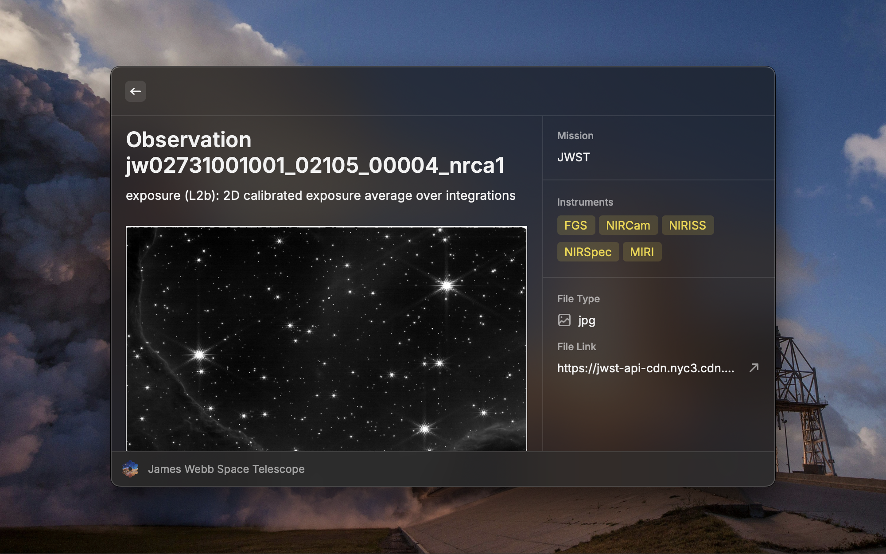

# James Webb Space Telescope Raycast Plugin

Lists all of the publicly available images and data from James Webb Space Telescope's observations

## Functionality

- Provides a single Raycas command - "James Webb Space Telescope"
- Lists all of the data grouped by program
- Lists all of the data by file type (like .jpg, .fits, .csv, etc)
- Shows detailed information about observation data (photo, mission, description, instruments used)
- Provides a link to download observation data

Note: Text search works only for the data you've already fetched.

## Development

- This plugin is essentially a view layer built on top of the API from [jwstapi.com](https://jwstapi.com/). Thanks to Kyle Redelinghuys ([GitHub profile](https://github.com/ksred))
- Original data comes from [Mikulski Archive for Space Telescopes](https://archive.stsci.edu/publishing/mission-acknowledgements)
- Plugin is composed using elemetns from standard Raycast plugin tech. stack: React, TypeScript, @raycast/api and @raycast/utils
