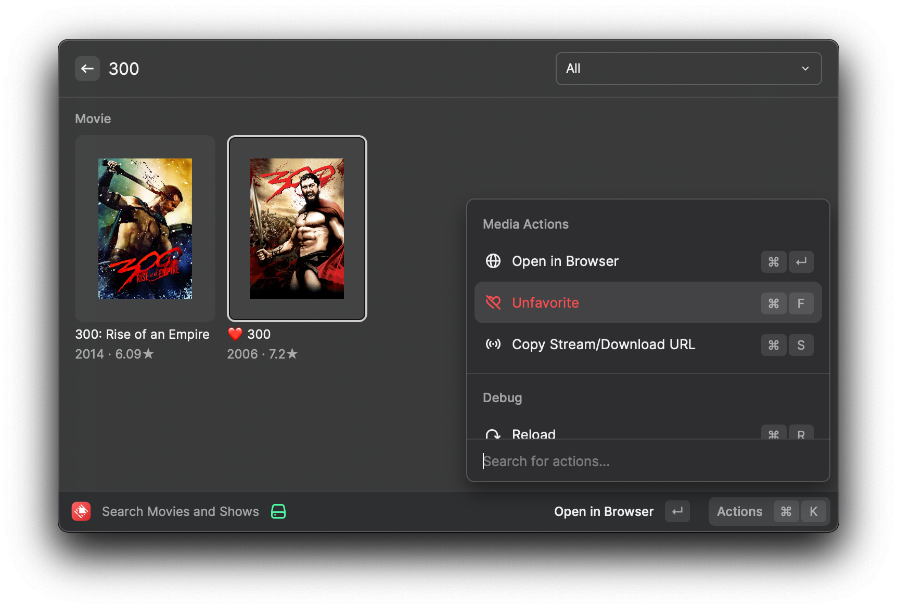
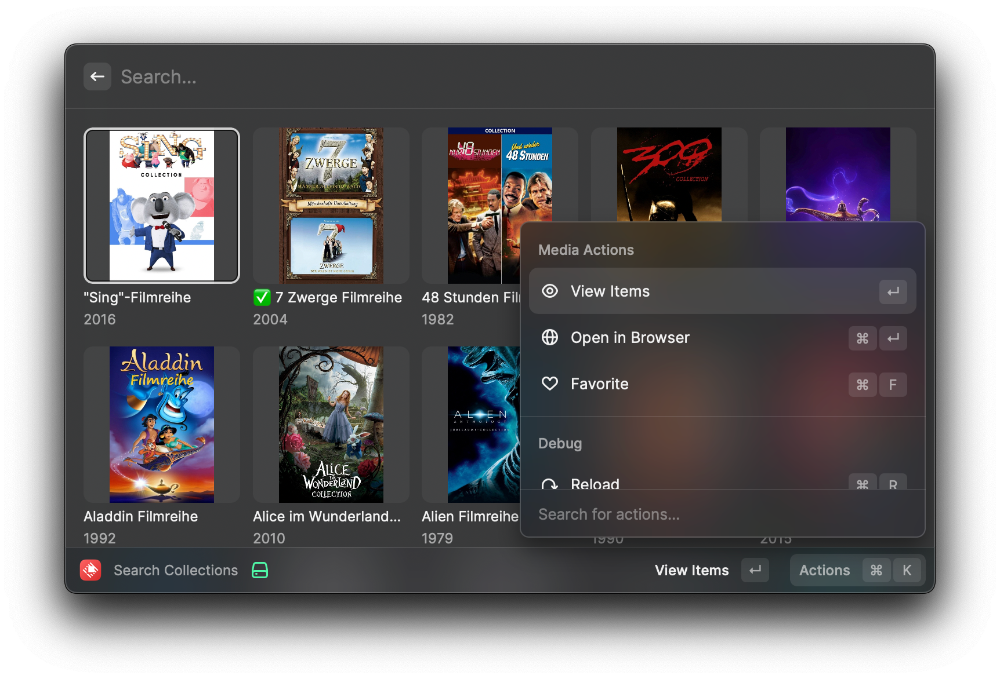
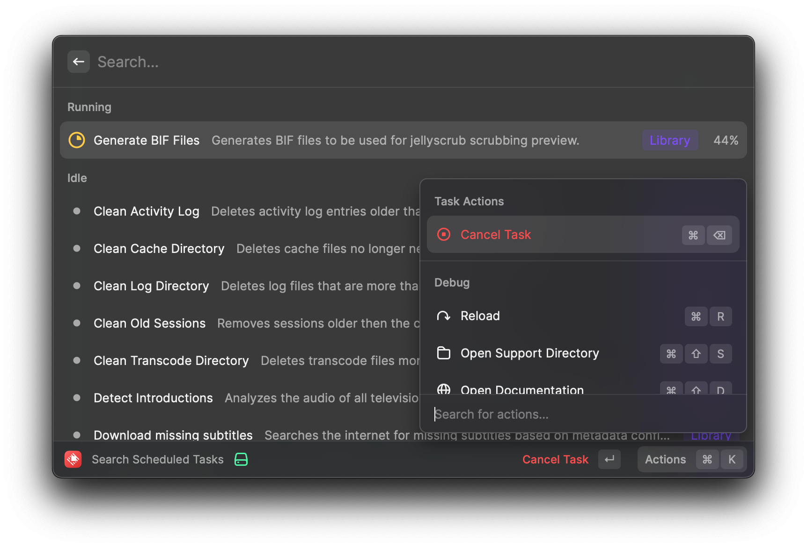
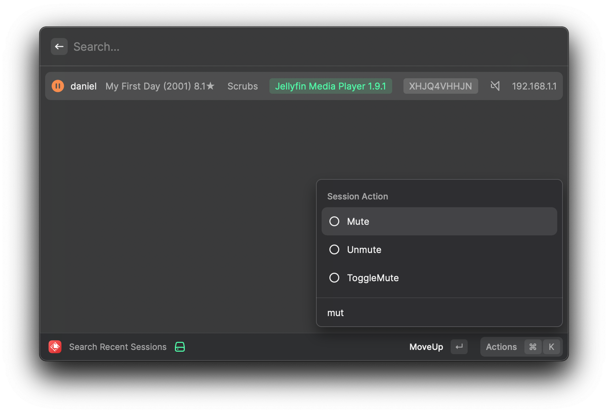

# Jellyfin Extension for Raycast

This extension aims at adding support to find Collections, Movies, Shows, Scheduled Tasks, and Recent Sessions on your Jellyfin instance.

---

# 🛠️ Setup

## Obtain your User ID

1. Go to your `Administrator Dashboard` -> `Users` -> Select your user.
2. The URL of this page should look like this: `https://jellyfin.example/web/index.html#!/useredit.html?userId=6ca1985577a843fd9949d811f6af9248`.
3. Copy the User ID from the URL (the part after `userId` -> `6ca1985577a843fd9949d811f6af9248`).
4. Update it in the extension's preferences (`Cmd` + `Enter`).

## API Key

1. Go to your `Administrator Dashboard` -> `API Keys` -> And click on the button with the plus `[+]`.
2. You can give the API Key a name, like `Raycast`.
3. Copy the API Token.
4. Update it in the extension's preferences (`Cmd` + `Enter`).

If you're confident that your API Token / User ID is accurate and you are still receiving errors, please submit an [issue](https://github.com/darmiel/raycast-extension-jellyfin/issues).

---

# 🏞️ Screenshots

## Search Movies and Shows

## Search Collections

## Control Scheduled Tasks

## Control Active Sessions

---

# 🌟 Feedback and Contributions

You are welcome to contribute to the project by submitting pull requests. Also, if you find any problems, you can submit an issue [here](https://github.com/darmiel/raycast-extension-jellyfin/issues/new).

---

# ⚖️ License

This project is licensed under the terms of the MIT license.
