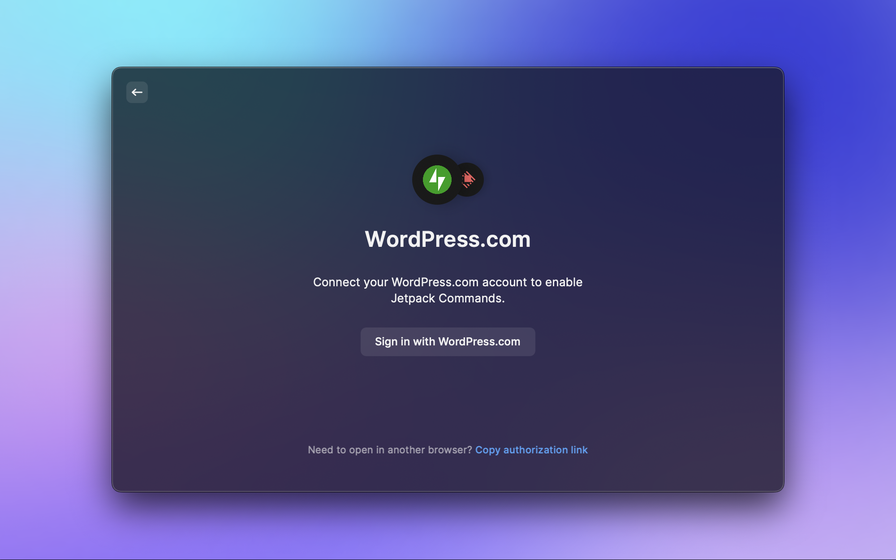
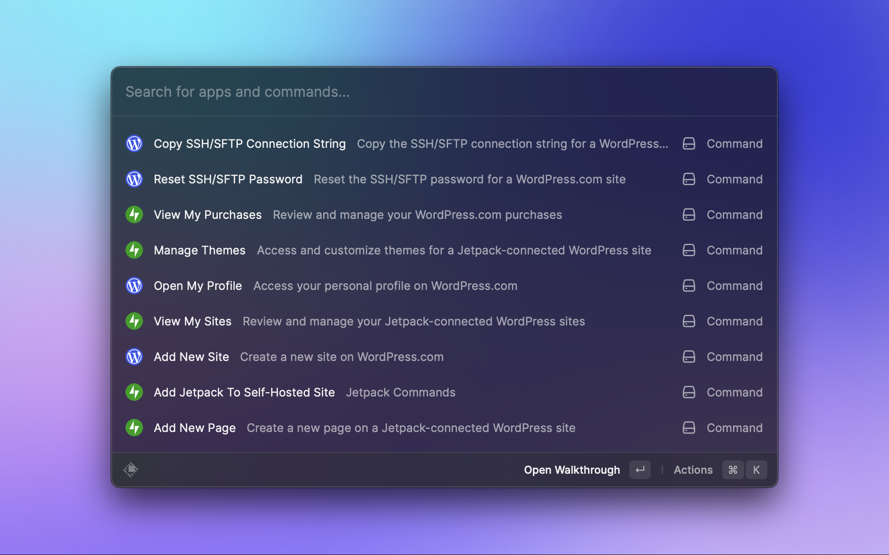

# Jetpack Commands Raycast Extension

## Authentication

The Jetpack Commands Raycast Extension authenticates with the [WordPress.com](https://wordpress.com) API to retrieve information about your sites. Each site must also have an active Jetpack connection.

When you first run a command, you'll need to connect to WordPress.com in through your web browser. Once you've connected, Raycast will store the oAuth token for future requests.



## Running Jetpack Commands locally

In order to run Jetpack Commands Raycast Extension locally, you'll need to have the following installed:

1. [Raycast](https://raycast.com/)
2. [Node.js](https://nodejs.org/)

Once you have Raycast and Node installed, you can run the following command to install the project's dependencies:

```bash
npm install
```

To run the extension locally, you can run the following command:

```bash
npm run dev
```

After running the command above, you should see the new commands listed under the "Developer" section of command list in Raycast.
The extension will automatically reload if you make any changes to the code.


