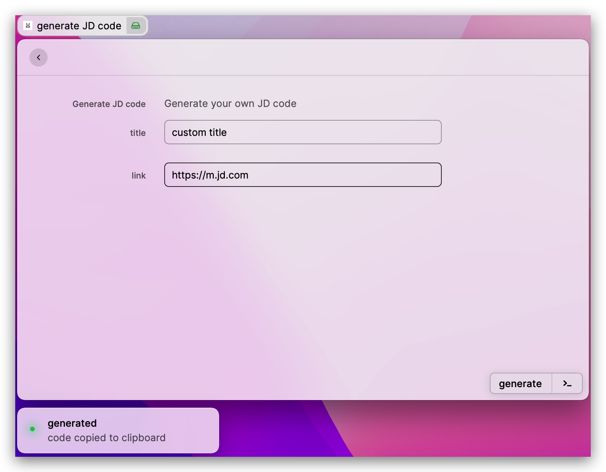
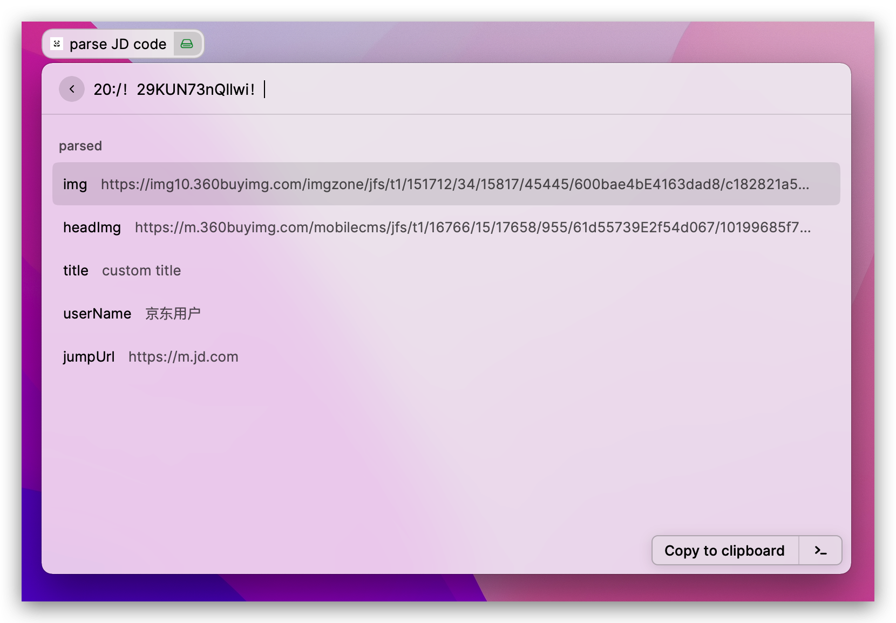

# jing-kou-ling
> generate or parse JD code

## enjcode
> generate your custom title and link to JD code

 -   enter your custom title in form 
     > Exp:"my own title"`

 -   enter your custom link about jd in form
     > Exp: `https://m.jd.com`
     
     > Exp: `https://mall.jd.com/index-1000000127.html`

     > Exp: `https://item.jd.com/100014352539.html`

 -   then press `command+enter`

 -   your custom JD code will copy to your clipboard
     > Exp: `20:/！29KUN73nQllwi！`

 -   open JD application, you'll see the code info

## dejcode
> parse JD code to get thier params

 - paste your JD code to input label
   > Exp: `20:/！29KUN73nQllwi！`

 - you'll see the params of this code
     > something params such as `Img`、`headImg`、`title`、`jumpUrl` of this code

 - if your want copy which param you can select this and press `command+enter`

