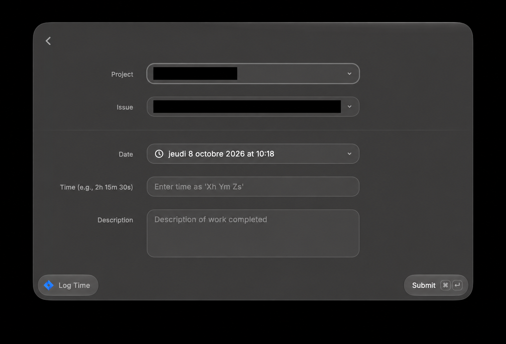
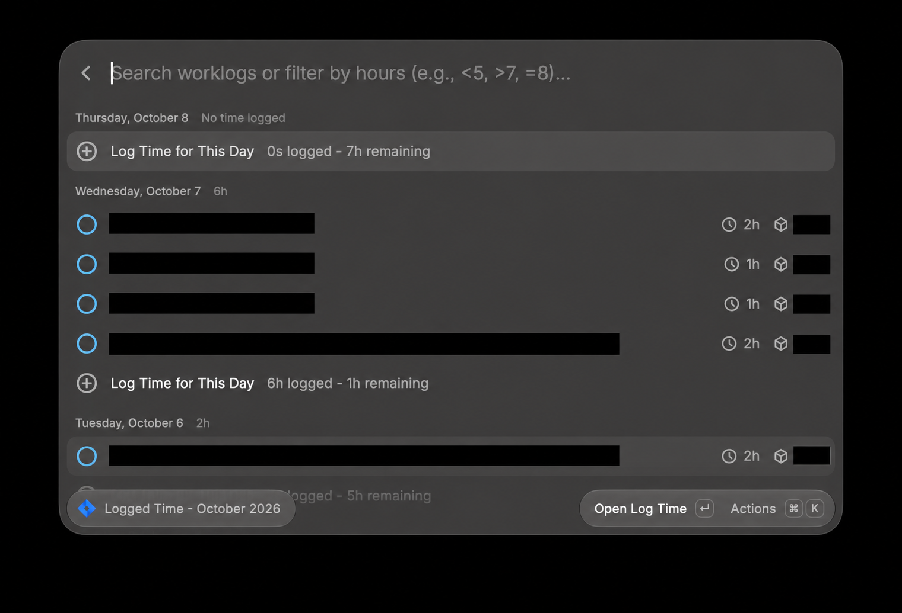
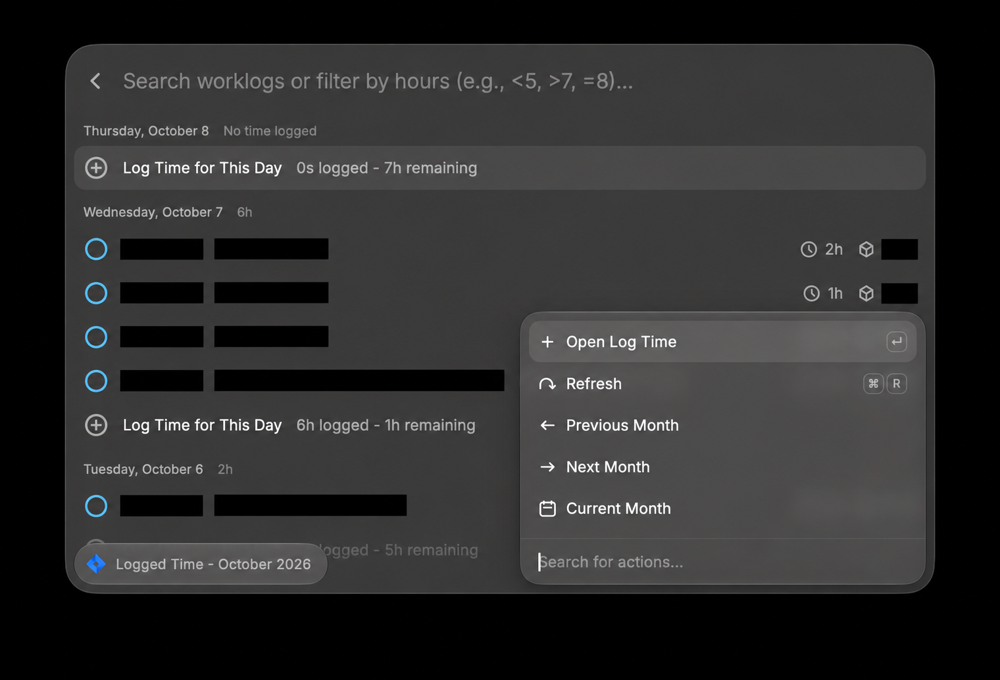

# Jira Time Tracking

This extension helps you to quickly log, view, and manage time tracking on Jira issues. It supports both Jira Server and Jira Cloud users.

## Features

### Log Time

- Quickly log time to any Jira issue
- Select project and issue from dropdown menus
- Enter time in flexible format (e.g., `2h 30m`, `1h`, `45m`)
- Add descriptions to your work logs
- Choose the date when the work was performed

### View Logged Time

- Browse your logged time by month with weekday reminders and any logged weekend days
- Navigate between months (Previous/Next/Current)
- See daily totals and monthly summary
- Visual indicators for days below your daily hours threshold
- Timezone-aware date grouping

### Manage Work Logs

- **Edit Work Logs** (`Cmd+E`): Update time, description, or date of existing logs
- **Delete Work Logs**: Remove incorrect entries with confirmation
- **Log More Time** (`Cmd+L`): Quickly add more time to the same issue
- **Log Time on Another Task** (`Cmd+Shift+L`): Switch to a different issue

### Advanced Filtering

Filter your logged time using powerful search syntax:

- `<5` - Show days with less than 5 hours logged
- `>7` - Show days with more than 7 hours logged
- `=8` or `8` - Show days with exactly 8 hours logged
- Text search - Search by issue key, summary, or description (e.g., "PROJ-123", "bug fix")

## Screenshots

Contributor-provided Raycast screenshots with sensitive Jira identifiers, project names, and work descriptions redacted.

### Log Time

### View Logged Time

### Refresh and Month Navigation

## Setup

To use this extension, you need to configure the following preferences:

- **Jira Instance Type**: Select whether you are using Jira Cloud or Jira Server.
- **Jira Domain**: The domain/site URL of your Jira instance, e.g., `company.atlassian.net`.
- **Jira Username**:
  - For Jira Cloud: Your email address
  - For Jira Server: Your username
- **API Token**:
  - For Jira Cloud: An API token created as described in [Manage API tokens for your Atlassian account](https://support.atlassian.com/atlassian-account/docs/manage-api-tokens-for-your-atlassian-account/). Use an unscoped token with your site's REST API.
  - For Jira Server/Data Center: A personal access token for your instance, sent using Bearer authentication. See [Using personal access tokens](https://confluence.atlassian.com/enterprise/using-personal-access-tokens-1026032365.html).
- **Custom JQL Query**: Enter a JQL query to filter issues dynamically (optional). Example: `assignee = currentUser() AND status = "In Progress"`.
- **Default Project Key**: The key of the project to be selected by default (optional). Example: `MYPROJECT`.
- **Daily Hours Threshold**: Set your expected daily working hours (default: 7). Days below this threshold will show a reminder to log more time.

## Worklog Notes

- Monthly totals include all your visible worklogs for the selected month, including weekend entries. Empty-day reminders appear only on weekdays up to today.
- Viewing and changing worklogs requires the corresponding Jira project and worklog permissions. A failed fetch is reported instead of displaying a partial total.
- Editing only the duration or date preserves the original Jira comment. Changing the description replaces it with plain text (formatted as an Atlassian document on Jira Cloud).
- Durations must use whole hours, minutes, and seconds in that order, for example `2h 30m`, `45m`, or `30s`. Invalid or partial inputs are rejected.

## Development

Run `npm ci`, `npm test`, `npm run lint`, and `npm run build` from this extension's folder. Run `npm run dev` to load it into Raycast with automatic rebuilding. The regression tests use fixture responses and never access a real Jira account.
