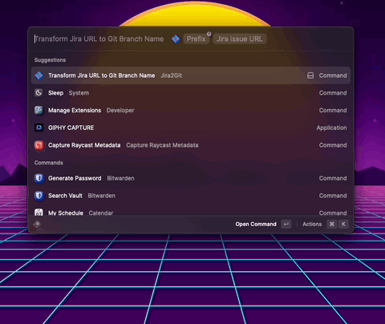

# Jira2Git

The tool for making Jira and Git work together smoothly as silk for a better development experience.

## Features

- Transform Jira URL to Git branch name

## Setup

To connect the extension to your Jira instance you need to fill the following preferences:

- **Jira Domain:** The domain of your Jira cloud instance like `mycompany.atlassian.net`.
- **User Name:** Your Jira user name – mostly your e-mail address.
- **API Token:** An API token created as described in [Manage API tokens for your Atlassian account](https://support.atlassian.com/atlassian-account/docs/manage-api-tokens-for-your-atlassian-account/).
