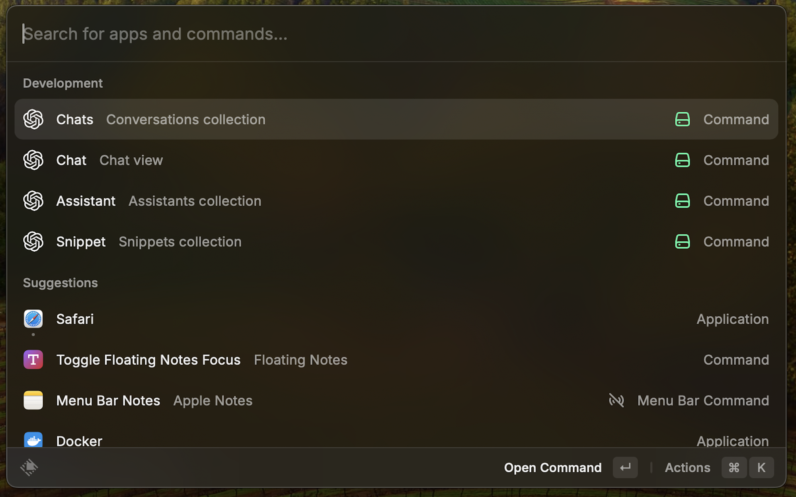

Made with ♥ from Poland

---

<h1 align="center">Jose</h1>

<h3 align="center">
Chat with GPT straight from your computer
</h3>

# Still in development

#### Features
- langChain - intent
- langChain - skill
- langChain - memory

#### Models
- Azure OpenAI
- Gemini
- Groq
- Cohere
- Perplexity
- Anthropic
- Ollama

#### Binnary
- blueprint golang
- blueprint nodeJs

# Features
1. **Personalized Assistants:** Custom prompts for each user.
2. **Snippets Creation:** Small tasks for conversation.
3. **Conversation History:** Keep track of chats.
4. **Chat with Specific Assistant:** Use snippets.
5. **Webhook Response:** Connect to Make/n8n.
6. **API Communication:** Interact with your API.
7. **Local Binary Script Communication:** Chat with local scripts.

# API Endpoint
- [Blueprint make.com](metadata/blueprint-make.json)
- [Blueprint n8n.io](metadata/blueprint-n8n.json)

# Models availability

- GPT 3.5*
- GPT 4*

# How to use

1. Sign up or log in to [OpenAI](https://platform.openai.com/account/api-keys).
2. Navigate to the API Keys section.
3. Create a new `Secret Key`.
4. Ensure you have a `pay-as-you-go` plan account.
5. Use the created `Secret Key` as your API Key in the extension.

# Preferences

All preferences properties list that can be customize through `Raycast Settings > Extensions > Jose`

| Properties                   | Label                          | Value       | Required | Default    | Description                                                                                          |
| ---------------------------- | ------------------------------ | ----------- | -------- | ---------- | ---------------------------------------------------------------------------------------------------- |
| `apiOpenAiKey`               | Open AI API Key                | `string`    | `false`  | `empty`    | Your personal Open AI API Keykey                                                                     |
| `apiEndpoint`                | API Endpoint                   | `string`    | `false`  | `empty`    | API endpoint for communication answer                                                                |
| `apiBinnary`                 | Path to binnary script         | `file`      | `false`  | `empty`    | Binnary endpoint for communication                                                                   |
| `apiEndpointData`            | API Endpoint Data              | `string`    | `false`  | `empty`    | API endpoint for download assistants and snippets                                                    |

---

Made with ♥ from Poland

