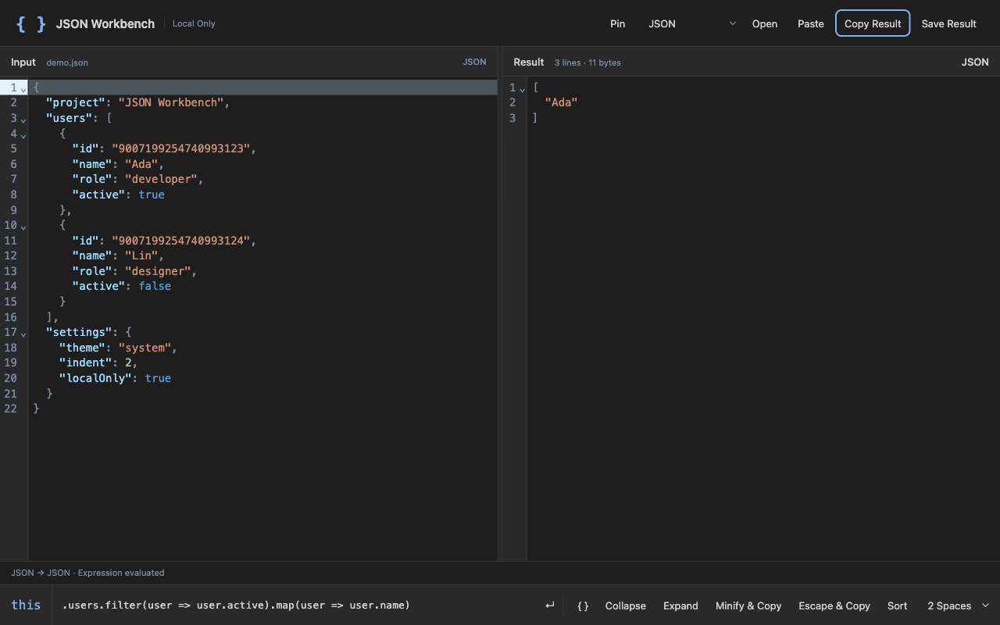

# JSON Workbench for Raycast

Edit, inspect, transform, and convert JSON locally. **Open JSON Editor** launches a dedicated macOS window with a full-width input editor. Enter a JavaScript expression to reveal a second pane with the live result. **Preview JSON** browses objects and arrays inside Raycast.

[中文说明](README.zh-CN.md)



## Requirements and Input

macOS 13 or later and Raycast. The extension includes an Apple Silicon / Intel universal helper built from the Swift source in this repository. Store users do not need Xcode, a separate app, or an additional download.

Both commands accept optional JSON text or an absolute file path. Otherwise they read selected text first, then the clipboard. Selection lookup can be disabled in extension preferences.

## Editor

- A single pane until a transform is entered; clearing the expression restores the single pane.
- Syntax highlighting, line numbers, collapse / expand, search, undo / redo, and a resizable divider.
- Automatic formatting on load and paste. Copy produces formatted JSON while preserving the input text and its comments; Minify & Copy and Escape & Copy are separate actions.
- An always-on-top switch that remembers its setting.
- JSON, JSON5, YAML, XML, URL parameters, and escaped JSON input.
- JSON, YAML, XML, TypeScript types, and escaped JSON output, recursive key sorting, and 2 / 4 space indentation.
- Native file open / save panels and unsaved-edit warnings.

The editor uses the system light or dark appearance. UI labels are in US English.

## Transforms

`this` is the parsed input. Examples:

```js
Object.values(this).map(items => items.map(item => item.name))
;Object.values(this).map(items => items.map(item => item.name))
.filter(item => item.enabled)
[0][1]
this.users.map(user => ({ id: user.id, name: user.name }))
```

Transforms must synchronously return a JSON value. Each runs in a fresh QuickJS WASM runtime with an 800 ms time limit, 64 MiB memory limit, and 1 MiB stack limit. It has no network, filesystem, Node.js, or native bridge access.

## Privacy and Precision

Documents and transforms stay on your Mac. There is no telemetry, remote CDN, or document persistence. A temporary input handoff is created with owner-only permissions and deleted after the window reads it. Failed or unresponsive launches also remove the handoff; the next launch cleans up stale handoffs left by an interrupted Raycast process. Only the pin preference persists.

Standard JSON numeric tokens are preserved when previewing, formatting, and copying JSON. Transforms reject inputs that JavaScript numbers cannot represent exactly; use strings for large identifiers. JSON5 follows JavaScript number semantics. YAML conversion preserves large integer tokens and rejects decimals that would lose precision. XML conversion rejects values that may lose precision. Use JSON output to preserve those numeric tokens.

Inputs and transform results are limited to 8 MiB, with a nesting limit of 256. Raycast lists paginate at 150 entries; text previews stop at 30,000 characters. Copy and export use the full value. TypeScript inference samples up to 200 array items and is a starting point rather than a complete schema.

## Development

```sh
npm ci
npm run dev
```

The committed assets are sufficient to develop or build the Raycast commands. After changing Swift or editor sources, rebuild the helper on macOS with Xcode Command Line Tools:

```sh
npm run build:editor
npm test
npm run typecheck
npm run lint
npm run lint:source
npm run build
```

See [native build provenance](docs/native-build.md) for the universal binary build and verification steps. `npm run build` runs the standard Raycast distribution build using committed assets. `npm run build:all` also rebuilds the native helper.

## License and Reference

MIT. The workflow was inspired by the uTools JSON editor, with an independent implementation. No uTools source or assets are included. See [reference analysis](docs/reference-analysis.md).
