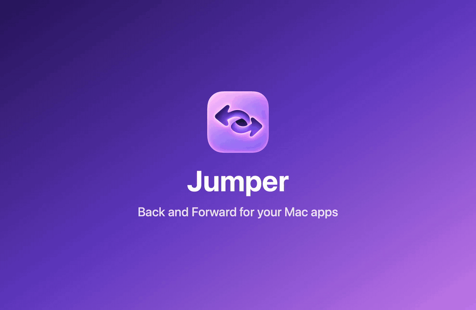

# Jumper

Jump to any app, tab, or session on your Mac.

Cmd+Tab only knows "most recent" and reshuffles every time you switch, so getting back to the app you were in three switches ago is guesswork. Jumper lets you step back through your recently used apps, and forward again, exactly like history in Safari or VS Code. And when what you want is a browser tab, a terminal tab, or a Claude session, search them all in one list and jump straight there.

## Commands

- **Back**: switch to the app you used before this one. Run it again to keep going back.
- **Forward**: retrace a Back step.
- **Toggle**: flip between your two most recent apps. Run it again to switch back.
- **History**: list running apps from most to least recently used and jump to any of them.
- **Tabs**: search the tabs, windows, and sessions of every running app and jump straight to one: browser tabs, terminal tabs, Claude and Muse chat sessions, and any app's windows.
- **Tabs in Current App**: the same, for the app you're in.

## Setup

Back, Forward, and Toggle are meant to be used with hotkeys:

1. Open Raycast Settings → Extensions → Jumper.
2. Assign a hotkey to each command, for example `⇧⌘[` for Back, `⇧⌘]` for Forward, and a double tap of `⌘` for Toggle (the keys shown in the demo).

`⇧⌘[` and `⇧⌘]` also switch tabs in browsers, Terminal, and many editors; a Raycast hotkey takes priority, so pick something like `⌃⌥[` / `⌃⌥]` if you rely on those.

Back, Forward, Toggle, and History need no permissions and no background process: they read the order macOS already keeps for Cmd+Tab.

Tabs and Tabs in Current App ask for permissions the first time:

- **Automation**: macOS asks once per app ("Raycast wants to control Google Chrome"). Needed for browsers and terminals.
- **Accessibility**: for other apps' windows and for Claude and Muse sessions. Grant it to Raycast in System Settings → Privacy & Security → Accessibility.

An app Jumper can't read shows under **Unavailable**, with a shortcut to the right settings pane.

## How it works

- The first **Back** remembers your current app order and moves one step back.
- Pressing Back again goes further; **Forward** retraces.
- Switching apps any other way (click, Cmd+Tab) starts a fresh history, just like visiting a new page in a browser clears the forward history.
- Apps you quit are skipped.
- In **History**, **Remove from History** (`⌃X`) hides an app (including the one you're in, once you leave it), for example one you closed all windows of but didn't quit. It comes back once you use it again.
- **Exclude from History** (`⌃⇧X`) hides an app for good. Excluded apps are listed at the bottom of History; **Include in History** brings one back.

### Tabs

| App | Lists |
|---|---|
| Chrome, Brave, Edge, Vivaldi, Chromium, Safari | Tabs |
| cmux | Workspaces |
| iTerm, Terminal | Tabs |
| Claude | Sessions in the sidebar |
| Muse | Main chat and side chats |
| Any other app | Windows, and tabs if the window has a native tab bar |

Apps are ordered by recent use; within an app, active tabs come first. Picking an entry selects it in its app and brings the app to the front. **Copy URL** and **Copy Title** are in the action panel. Claude and Muse are read from their on-screen sidebar, so an app update can change what Jumper finds; if the sidebar isn't found, the app's windows are listed instead.

## Support

Jumper is free and open source. If it saves you time, you can [sponsor its development on GitHub](https://github.com/sponsors/mattherwig).
