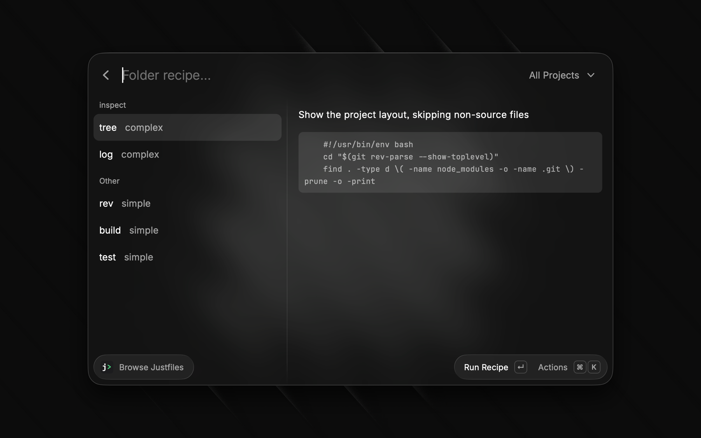
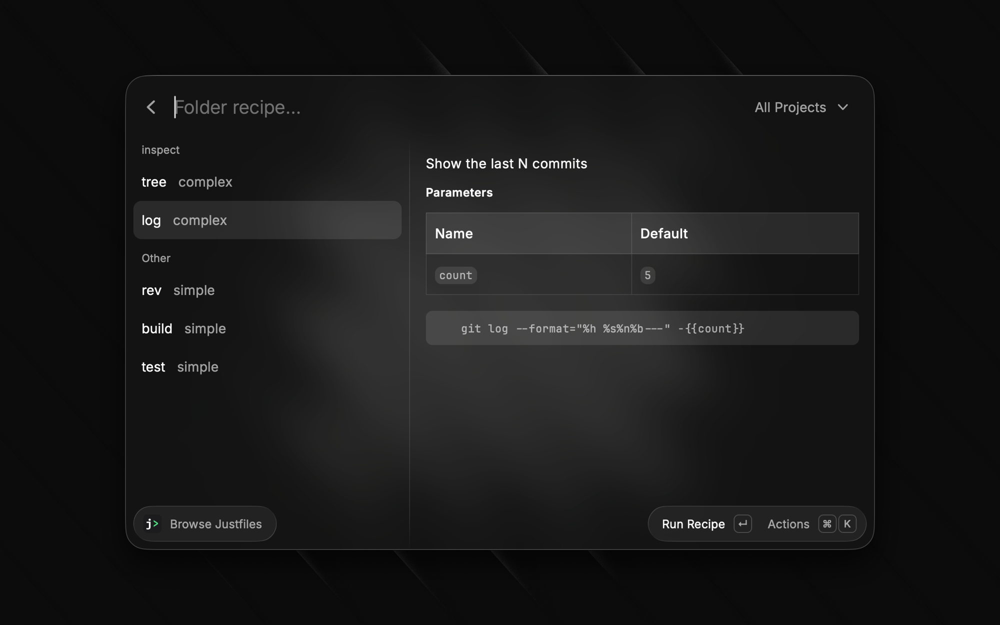
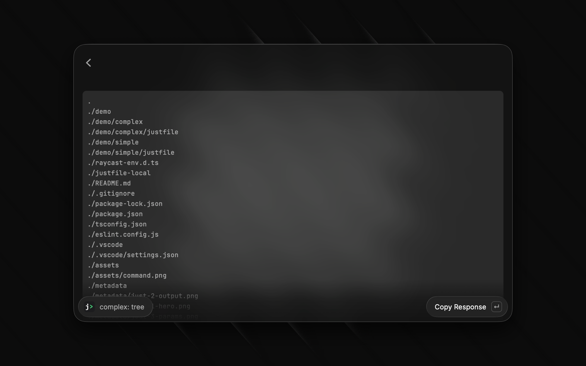

# Just for Raycast

Run [just](https://just.systems) recipes from anywhere on your machine directly in Raycast. Browse and search recipes across multiple justfiles, run them inline, and wire up hotkeys to your most-used commands.



## Prerequisites

Just (`just`) must be installed on your system:

```bash
brew install just
```

## Commands

### Browse Justfiles

Search across all configured justfile directories by folder name and recipe. Select a recipe to run it and view its output inline. Recipes with parameters open a form to fill in values before running.





### Run Recipe

The headless recipe runner runs a recipe silently and shows the result in a HUD notification. Designed for use in Quicklinks where you want zero UI overhead.

**Tip:** Use Raycast Quicklinks to bind a specific folder + recipe to a hotkey. Create a Quicklink with a deep link and assign it a global shortcut (e.g. `🌐 j`) to invoke a recipe instantly.

```txt
raycast://extensions/alastairsounds/just/run-recipe?arguments=%7B%22folder%22%3A%22project%22%2C%22recipe%22%3A%22pre-commit%22%7D
```

> [!NOTE]
> The `arguments` value is a JSON object, for example `{"folder":"project","recipe":"pre-commit"}`. You can encode this object into the URL above with a URL encoder, for example [it-tools.tech/url-encoder](https://it-tools.tech/url-encoder).
>
> `folder` can also be an absolute or `~`-relative path to a directory containing a justfile (e.g. `~/.config/.scripts`), which works even if that folder isn't listed in the Justfile Folders preference.

## Configuration

### Justfile Folders (optional)

A comma-separated list of directories to scan for justfiles. Each directory is searched one level deep.

Example: `~/dotfiles, ~/projects/myapp, ~/work`

If you leave this preference blank, use the "Manage Folders" action instead. Manage Folders is not a separate command. Find it inside Browse Justfiles. Browse Justfiles shows it by default when it finds no justfiles. You can also open it at any time from the ⌘K Actions menu on a recipe.

Manage Folders lists every folder from earlier searches, including folders from this preference, as tags. Untag a folder to stop searching it. The folder stays in the list, so you can re-tag it later without browsing for it again. A separate folder picker adds new folders.

Use the "Restore Justfile Folders" action to add back every folder from this preference at once. This action restores folders that you untagged.
