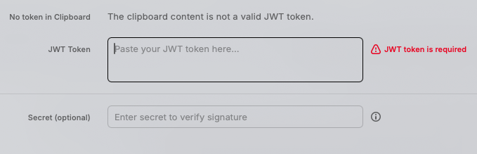
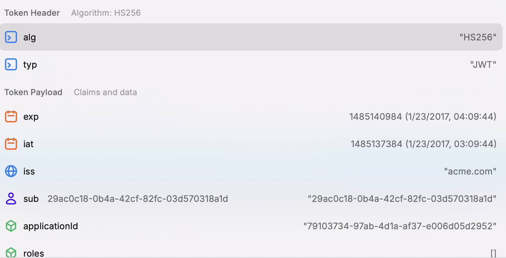

# JWT Parser for Raycast

A beautiful and easy-to-use JWT token parser and validator for Raycast.

## Features

- Automatically detects and uses JWT tokens from clipboard
- Colorful display of token header, payload, and signature
- Human-readable timestamps for exp, iat, and nbf fields
- Optional signature verification with custom secret
- Copy decoded payload to clipboard

## Screenshots

### Main Form


### Decoded View


## Usage

1. Launch the "Parse JWT Token" command in Raycast
2. The extension will automatically check your clipboard for a JWT token
3. If needed, paste or type your JWT token in the input field
4. Optionally, enter a secret key to verify the token's signature
5. View the decoded token data with color-coded formatting
6. Use actions to copy token data or clear the form

## Keyboard Shortcuts

- ⌘↵ Parse JWT
- ⌘V Use clipboard content
- ⌘T Use sample token
- ⌘R Clear form
- ⌘C Copy decoded payload
- ⌘B Back to form (in detail view)

## Installation

1. Install the extension from the Raycast Store
2. Open Raycast and type "Parse JWT"
3. Start parsing your JWT tokens!

## Development

```bash
# Install dependencies
npm install

# Start development server
npm run dev

# Build extension
npm run build

# Run linting
npm run lint
```

## License

MIT

## How it works

JWT tokens consist of three parts: header, payload, and signature, separated by dots. This extension:

1. Decodes the Base64URL-encoded header and payload
2. Displays the data in a readable format with color-coding for different data types
3. Optionally verifies the signature using the provided secret

## Credits

Built with ♥ using the Raycast Extension API