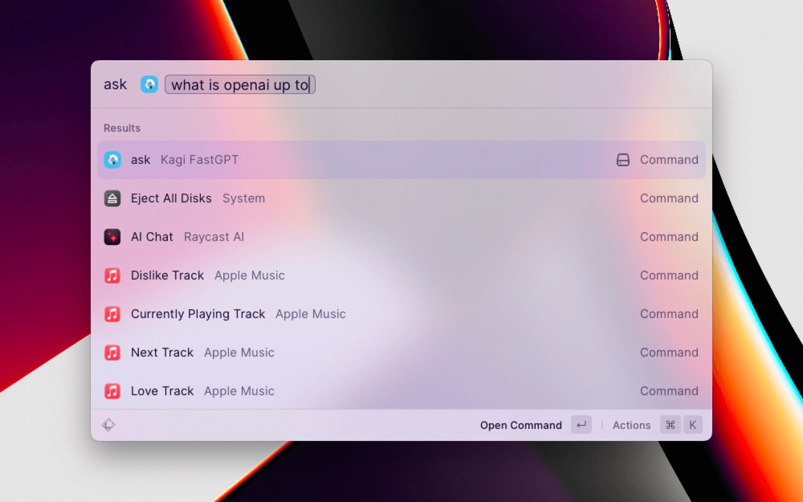
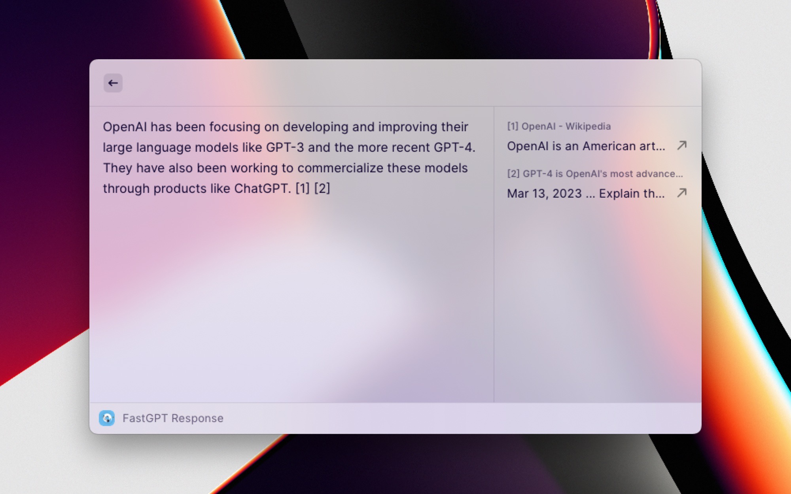

# Kagi FastGPT

Ask questions to Kagi's FastGPT AI engine.

## How it works

### Ask your question to FastGPT from Raycast

Invoke the "ask" command in Raycast and type in your query.

### Read your response supported by real web results

Responses from FastGPT are fact-based and come from Kagi's high quality search indices.

## Finding your API key

1. Log into your [Kagi](https://kagi.com) account.
2. Navigate to your [API Dashboard](https://kagi.com/settings?p=api).
3. Click the yellow "Generate New Token" button.
4. Copy that key and paste it into Raycast.
