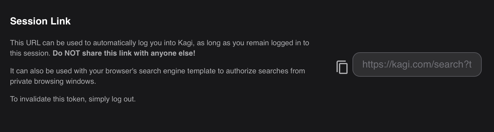
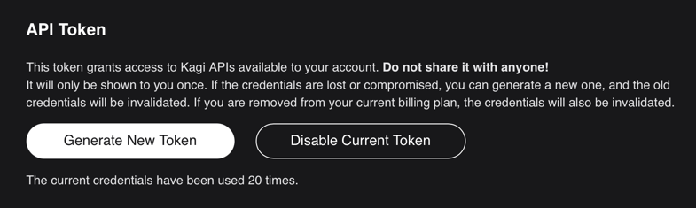

# Kagi Search for Raycast

Thanks for using the Kagi Search extension.

## Setup
### Session Link for Autocomplete
Using this extension requires getting your session token from your [Kagi account](https://kagi.com/settings?p=user_details). 
Copy and paste the contents of the text box into the "Session Link" in the Command Preferences.

### Search API
In addition, to get results directly in Raycast, there are two additional steps:
* Request access to the closed beta of the [Kagi Search API](https://help.kagi.com/kagi/api/search.html) by emailing [Kagi Support](support@kagi.com).
* Once approved, you must generate an API key from the API section of the [billing page](https://kagi.com/settings?p=billing_api) 
of your account. . Copy this and paste it into the "Kagi API Key" preference. This will permit access to both search and FastGPT. Keep in mind this is billed according to usage.
### Additional Settings
There are two other optional settings in the Command Preferences:
* "Use API for Search": (default: on) allows user to disable in-raycast responses to queries, even if you have an API Key.
* "Enable FastGPT Shortcut": (default: on) allows user to enable / disable in-Raycast responses from FastGPT by ending query with question mark.

## Future Features / Improvements
Here's some things that may be nice improvements I'd like to add (or have help with):
* Improved navigation (using actions.push,etc)
* Fallback to browser search of out of api balance
* Improved formatting of results for longer previews

Thank you! Enjoy!