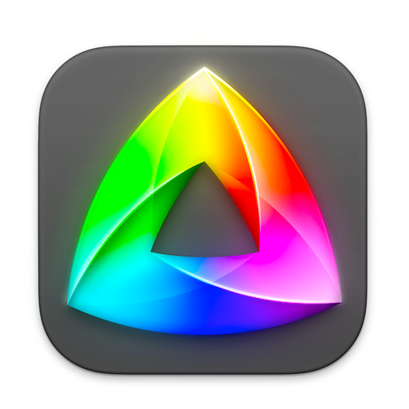
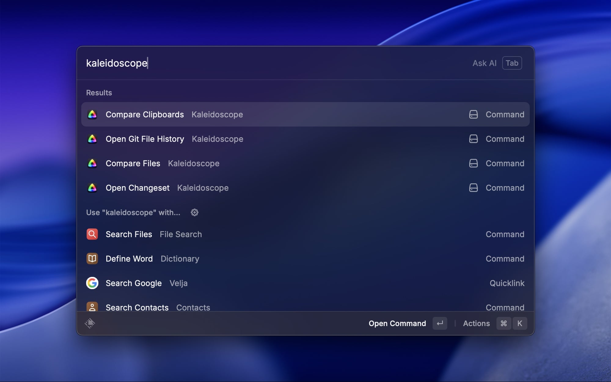

# Kaleidoscope ♡ Raycast

Compare or open content from Raycast in Kaleidoscope.

**Kaleidoscope for Mac needs to be installed** for this extension to work. Kaleidoscope is a powerful diff and merge tool that deeply integrates with Git. [Learn more](https://kaleidoscope.app) about Kaleidoscope and download a free 7-day trial.

Also keep a tab on the [Kaleidoscope Blog](https://blog.kaleidoscope.app) to learn about the latest Kaleidoscope features, integrations, and more.

## Commands

- [Compare Clipboards](#compare-clipboards)
- [Compare Files](#compare-files)
- [Open Changeset](#open-changeset)
- [Open Git File History](#open-git-file-history)

<picture>
    
</picture>

### Compare Clipboards

Compare the two latest entries in the Raycast Clipboard History.

_Note:_ Only content of the same type can be compared, text with text, or image with image.

### Compare Files

Compare Files (or Folders) selected in Finder, if Finder is frontmost, or up to six Files (or Folders) from the Raycast Clipboard History.

### Open Changeset

Show Changeset for a Git Commit. The Commit Identifier (aka Commit Hash) is taken from Clipboard, or manually provided.

_Note:_ Kaleidoscope needs to know the repository for this to work.

### Open Git File History

Show the History of Git commits for the File selected in Finder, if Finder is frontmost, or the File found on the Clipboard.

## Credits

A big thank you to [Gregor](https://github.com/anfalas) for creating the initial extension! Special thanks to [Boris](https://github.com/bjrmatos) for his valuable enhancements and guidance in making this an officially supported extension.

## Contributing

We welcome contributions to this extension. Fork the GitHub repository and create a pull request describing your improvements.

Also feel free to open an issue if you have any questions or suggestions. Or reach out to the Kaleidoscope team via [help@kaleidoscope.app](mailto:help@kaleidoscope.app?Subject=Raycast%20Extension%20Readme).
