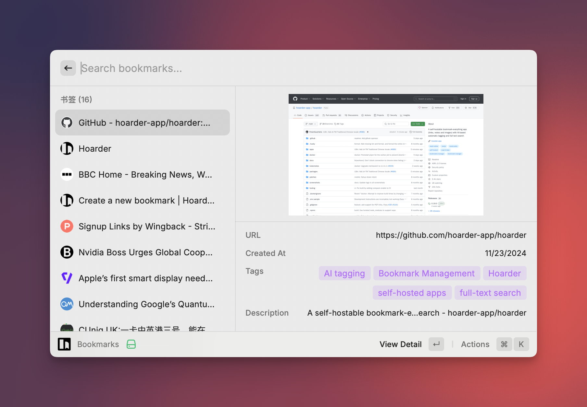
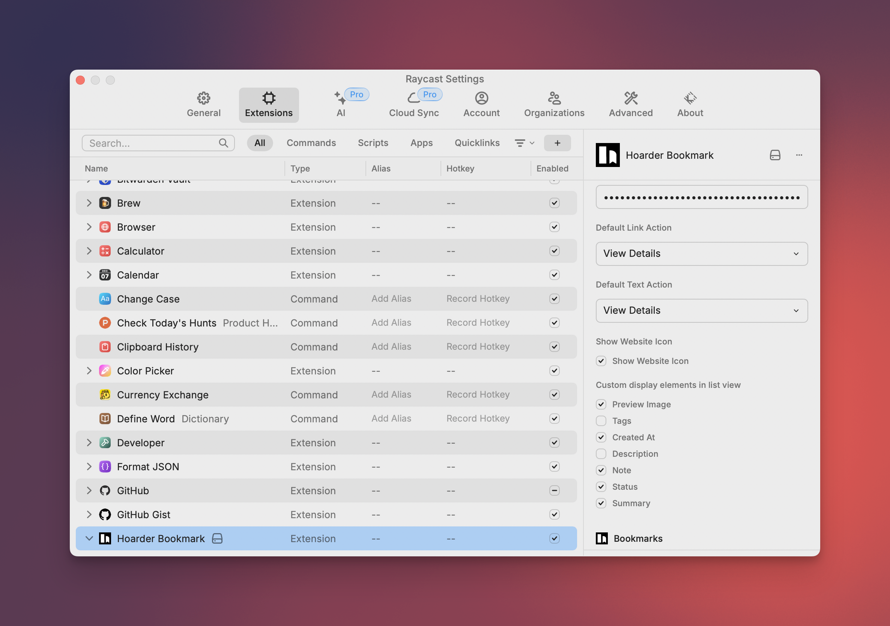

# 🚀 Raycast Karakeep


A user-friendly Raycast extension that seamlessly integrates with [Karakeep (previously Hoarder)](https://github.com/karakeep-app/karakeep), bringing powerful bookmark management to your fingertips. Quickly save, search, and organize your bookmarks, texts, and images—all through Raycast's intuitive interface.

This extension leverages Karakeep's API to provide a streamlined experience for managing your digital collection, complete with AI-powered tagging and search capabilities.



## 📥 Installation

### Option 1: Raycast Store

- [ ] Install directly from [Raycast Store: Karakeep](https://zuoluo.tv/raycast-karakeep)

### Option 2: Manual Installation

```bash
git clone https://github.com/foru17/raycast-karakeep.git
cd raycast-karakeep
npm install && npm run dev
# Enjoy it
```

## ✨ Features

### Core Features

- **Quick Access to Bookmarks**: Instantly view and access your saved bookmarks, screenshots, and content
- **List Management**: Browse and organize bookmarks through customized lists
- **Tag Organization**: Efficiently manage and filter content using tags
- **Fast Bookmark Creation**: Create new bookmarks directly from Raycast with just a few keystrokes

### Additional Conveniences

- **Intuitive Search**: Quickly locate any bookmark or content using the online search feature of Karakeep and the powerful search capabilities of Raycast.
- **One-Click Actions**:Open bookmarks in your browser, copy links, or delete instantly.
- **Preview Support**: View bookmark details and screenshots without leaving Raycast
- **Keyboard Navigation**: Fully keyboard-accessible for maximum efficiency
- **Customizable Display**:Set up your preferred information display for bookmarks

All powered by Karakeep's robust API, bringing your bookmark management right into Raycast's streamlined interface.

## 📑 Prerequisites

Before you begin, ensure you have the following:

- A deployed Karakeep instance (follow the [Karakeep installation guide](https://docs.karakeep.app/Installation/docker))
- Karakeep API credentials
- Raycast installed on your macOS system

I strongly recommend setting up Karakeep with Docker for easy deployment and management.

Create an API key by visiting `https://your-karakeep-instance.com/settings/api-keys` and clicking the 'New API Key' button.

## 🚦 Configuration

After installation, set up the extension with your Karakeep instance details:

1. Open Raycast Preferences
2. Navigate to the Extensions tab
3. Find "Karakeep" in the list of installed extensions
4. Enter your Karakeep API URL and authentication credentials



You can also customize the default main operations and the bookmark details you want to display.

## 🎯 Usage

Here's how to make the most of the Raycast Karakeep extension:

- **View All Bookmarks**: Access your complete bookmark collection
- **Search Content**: Utilize full-text search across all bookmarked content
- **AI Tagging**: Automatically categorize bookmarks using AI
- **Create New Bookmarks**: Add new bookmarks with ease
- **Edit Bookmarks**: Edit bookmark title and notes

## 🔧 Troubleshooting

If you encounter any issues:

1. Verify your Karakeep API credentials are correct
2. Ensure your Karakeep instance is running and accessible
3. Check the Raycast console for error messages
4. Verify your AI service configuration if using automatic tagging

If problems persist, please [open an issue](https://github.com/foru17/raycast-karakeep/issues) on the GitHub repository.

## 👥 Contributing

Contributions are welcome and appreciated! Here's how you can contribute:

1. Fork the repository
2. Create your feature branch: `git checkout -b my-new-feature`
3. Commit your changes: `git commit -am 'Add some feature'`
4. Push to the branch: `git push origin my-new-feature`
5. Submit a pull request

Please read [CONTRIBUTING.md](CONTRIBUTING.md) for details on our code of conduct and the process for submitting pull requests.

## 🙏 Credits

This extension is built on top of the [Karakeep](https://github.com/karakeep-app/karakeep) project. We're grateful for their work in creating such a powerful and flexible bookmarking solution.

Special thanks to [@kdurek](https://github.com/kdurek) for creating the original Raycast Karakeep extension, which laid the foundation for this enhanced version.

## 📄 License

This project is licensed under the MIT License - see the [LICENSE](LICENSE) file for details.

## ⭐ Support

If you find this extension helpful, consider:

- Starring the [GitHub repository](https://github.com/foru17/raycast-karakeep)
- Sharing it with others who might find it useful
- Contributing to the project's development

Your support helps keep this project active and improving!
