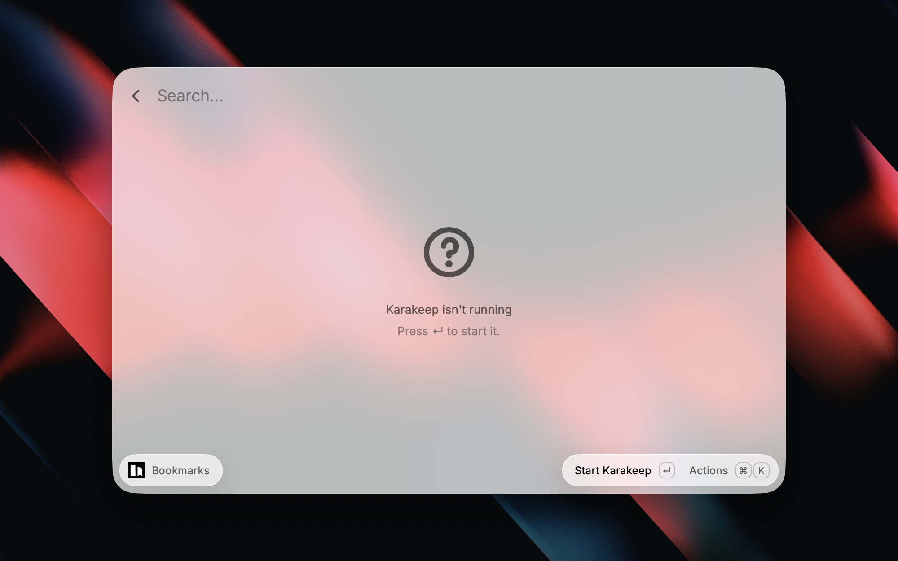

# Raycast Karakeep


A Raycast extension for [Karakeep](https://github.com/karakeep-app/karakeep), a self-hostable bookmark manager with AI-powered tagging. Save, search, and manage your bookmarks, notes, and highlights without leaving Raycast.

This extension leverages [Karakeep's API](https://docs.karakeep.app/api/) to provide a streamlined experience for managing your digital collection, complete with AI-powered tagging and search capabilities.

## 📥 Installation

### Option 1: Raycast Store

- [ ] Install directly from [Raycast Store: Karakeep](https://zuoluo.tv/raycast-karakeep)

### Option 2: Manual Installation

```bash
git clone https://github.com/foru17/raycast-karakeep.git
cd raycast-karakeep
npm install && npm run dev
# Enjoy it
```

## ✨ Features

### Core Features

- **Quick Access to Bookmarks**: Instantly view and access your saved bookmarks, screenshots, and content
- **List Management**: Browse and organize bookmarks through customized lists
- **Tag Organization**: Efficiently manage and filter content using tags
- **Fast Bookmark Creation**: Create new bookmarks directly from Raycast with just a few keystrokes

### Additional Conveniences

- **Intuitive Search**: Quickly locate any bookmark or content using the online search feature of Karakeep and the powerful search capabilities of Raycast.
- **One-Click Actions**: Open bookmarks in your browser, copy links, or delete instantly.
- **Preview Support**: View bookmark details and screenshots without leaving Raycast
- **Keyboard Navigation**: Fully keyboard-accessible for maximum efficiency
- **Customizable Display**: Set up your preferred information display for bookmarks
- **Docker-Aware Recovery**: If your local instance isn't running, the extension says so plainly and offers to start the container for you — then waits for Karakeep to come back and picks up where you left off

### Commands

- **Create Bookmark** — Add a new URL bookmark, optionally prefilled from your active browser tab.
- **Quick Bookmark** — Instantly bookmark the current browser tab with a single hotkey.
- **Create Note** — Add a new text note.
- **Bookmarks** — Browse, search, and manage your full bookmark collection. Filter by list, add a bookmark to a list, favorite, archive, summarize with AI, and copy links.
- **Lists** — Create, edit, and delete lists including smart lists with query-based filtering.
- **Tags** — Create, rename, and delete tags.
- **Notes** — View and manage text notes (bookmarks of type "text").
- **Highlights** — View, edit, and delete highlights saved from web pages.
- **Backups** — Create, download, and delete account backups. Backup status updates automatically — the list polls while a backup is in progress.
- **My Stats** — Overview of your library: bookmark counts by type, top domains, top tags, activity over time, and storage usage with charts.
- **Update Karakeep** — Pull the latest Docker images and restart a local instance, with live progress. macOS only; requires Docker Compose.

### Browser Extensions

Install the Karakeep browser extension to save pages directly from your browser and create highlights. Links to Chrome, Firefox, and Safari extensions are available from the Actions panel on any bookmark.

- [Chrome Extension](https://chromewebstore.google.com/detail/karakeep/kgcjekpmcjjogibpjebkhaanilehneje)
- [Firefox Add-on](https://addons.mozilla.org/en-US/firefox/addon/karakeep/)
- [Safari Extension](https://apps.apple.com/us/app/karakeeper-bookmarker/id6746722790)

## Prerequisites

Before you begin, ensure you have the following:

- A running [Karakeep](https://docs.karakeep.app/Installation/docker) instance
- A Karakeep API key — create one at `https://your-karakeep-instance.com/settings/api-keys`
- Raycast installed

It is strongly recommended to [set up Karakeep with Docker](https://docs.karakeep.app/Installation/docker) for easy deployment and management.

## Configuration

1. Open Raycast Preferences → Extensions → Karakeep
2. Enter your Karakeep API URL and API key

You can also customize default actions for link and text bookmarks, and choose which bookmark details to display (tags, description, note, summary, creation date, preview image).

## Running Karakeep locally with Docker

If you self-host Karakeep on the same Mac — the standard [Docker Compose setup](https://docs.karakeep.app/Installation/docker) — the extension detects when your instance is stopped and helps you get going again instead of failing with a generic network error.

When Karakeep isn't responding at your configured `apiUrl`, you'll see a **"Karakeep isn't running"** screen with:

- **Start Karakeep** — starts the stopped container. Karakeep's stock deployment runs several services (`web`, `meilisearch`, `chrome`), so the whole Compose project is started rather than just the web container, and the extension waits for the API to actually answer before reloading.
- **Open Docker** — jumps to the [Docker extension](https://www.raycast.com/priithaamer/docker) if you'd rather manage containers yourself.
- **Try Again** and **Copy Error** — retry, or copy the underlying cause (e.g. `ECONNREFUSED`) for a bug report.

The Create Bookmark, Create Note, and Create List forms check that the server is reachable *before* submitting, so a stopped instance never costs you what you typed. If it can't be reached, your input stays in the form and is copied to the clipboard as a backup.

If your container is not running, the extension will detect this and offer to start it for you.



Requirements: Docker Desktop running, and Karakeep started at least once from Docker so the container exists. The extension never creates containers — it only starts ones you already have.

> **Using a hosted or remote instance?** None of this applies to you and nothing changes. The Docker checks only run when your API URL is `localhost` or `127.0.0.1` — an instance on another machine, including one elsewhere on your network, is left alone, and the Start action is hidden when there's no local container to start.

## Troubleshooting

1. Verify your API URL and key are correct
2. Ensure your Karakeep instance is running and accessible
3. If you self-host locally with Docker and the container is stopped, the extension will offer to start it — see [Running Karakeep locally with Docker](#running-karakeep-locally-with-docker)

If problems persist, [open an issue](https://github.com/raycast/extensions/issues/new?body=%3C!--%0APlease%20update%20the%20title%20above%20to%20consisely%20describe%20the%20issue%0A--%3E%0A%0A%23%23%23%20Extension%0A%0Ahttps://www.raycast.com/luolei/karakeep%0A%0A%23%23%23%20Description%0A%0A%3C!--%0APlease%20provide%20a%20clear%20and%20concise%20description%20of%20what%20the%20bug%20is.%20Include%0Ascreenshots%20if%20needed.%20Please%20test%20using%20the%20latest%20version%20of%20the%20extension,%20Raycast%20and%20API.%0A--%3E%0A%23%23%23%20Steps%20To%20Reproduce%0A%0A%3C!--%0AYour%20bug%20will%20get%20fixed%20much%20faster%20if%20the%20extension%20author%20can%20easily%20reproduce%20it.%20Issues%20without%20reproduction%20steps%20may%20be%20immediately%20closed%20as%20not%20actionable.%0A--%3E%0A%0A1.%20In%20this%20environment...%0A2.%20With%20this%20config...%0A3.%20Run%20%27...%27%0A4.%20See%20error...%0A%0A%23%23%23%20Current%20Behaviour%0A%0A%0A%23%23%23%20Expected%20Behaviour%0A%0A%23%23%23%20Raycast%20version%0AVersion:%201.104.8%0A&title=%5BKarakeep%5D%20...&template=extension_bug_report.yml&labels=extension,bug&extension-url=https://www.raycast.com/luolei/karakeep&description) on GitHub.

## 👥 Contributing

Contributions are welcome and appreciated! Here's how you can contribute:

1. Fork the repository
2. Create your feature branch: `git checkout -b my-new-feature`
3. Commit your changes: `git commit -am 'Add some feature'`
4. Push to the branch: `git push origin my-new-feature`
5. Submit a pull request

## Credits

Built on top of the [Karakeep](https://github.com/karakeep-app/karakeep) project.

Thanks to [@kdurek](https://github.com/kdurek) for the original Raycast Karakeep extension, and to [@foru17](https://github.com/foru17) for the enhanced version this is based on.

## License

MIT — see [LICENSE](LICENSE) for details.
