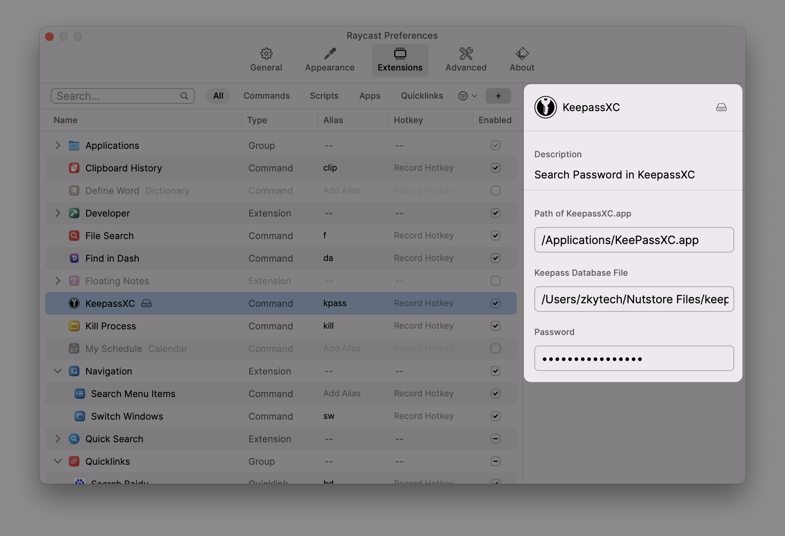
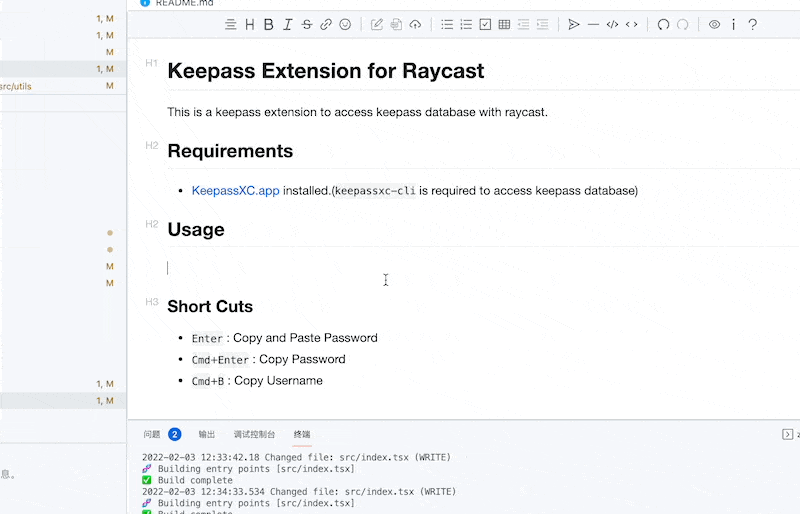

# KeepassXC Extension for Raycast

This is a Raycast extension to access keepass database.

## Requirements

- [KeePassXC.app](https://keepassxc.org) installed.(`keepassxc-cli` in `KeepassXC.app` is required to access keepass database

## Setup

There are 3 parameters required for this extension to work:

- path of `KeePassXC.app` (default `/Applications/KeePassXC.app`)
- a keepass database file
- password to access database



## Usage



### Shortcuts

- `Enter` : Paste Password
- `Shift`+`Enter` : Paste Username
- `Cmd`+`P` : Copy Password
- `Cmd`+`U` : Copy Username
- `Cmd`+`T` : Copy TOTP

## Password Security Note

This extension works by using `keepassxc-cli`(inside `KeePassXC.app`) in command line to access keepass database:

- Main password is stored by raycast. (encrypted)
- Main password will be send to `keepassxc-cli` by simulating command line interaction with nodejs api [subprocess.stdin.write](https://nodejs.org/api/child_process.html#subprocessstdin).

### Related commands

```bash
# List entries for version < 2.7
keepassxc-cli locate -q /path/to/database.kdbx /
# List entries for version >= 2.7
keepassxc-cli find -q /path/to/database.kdbx /

# Get password by entry
keepassxc-cli show -q -a Password /path/to/database.kdbx entry_name

# Get username by entry
keepassxc-cli show -q -a Username /path/to/database.kdbx entry_name

```
