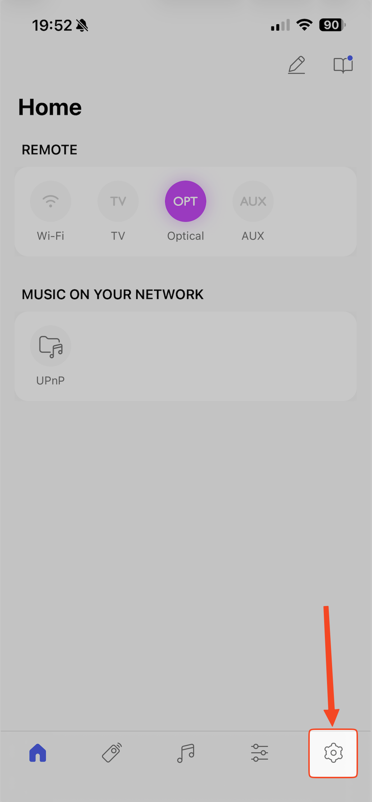
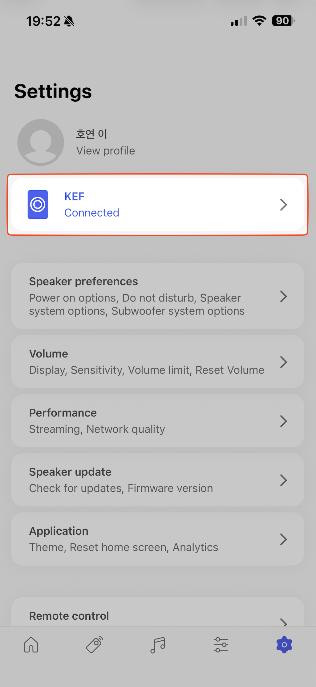
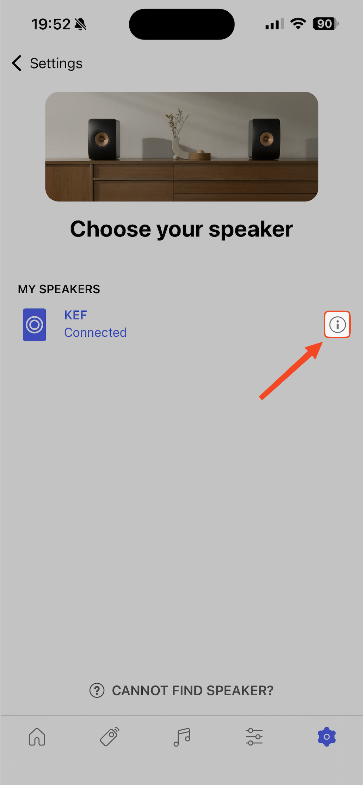

# Control Kef

### To start control Kef speakers

To start control Kef speakers, you need IP address of them.
You can find it in Kef Connect app.

#### 1. Enter app

### 2. Go to speakers setting

### 3. Select info icon

### 4. Look for ip address

