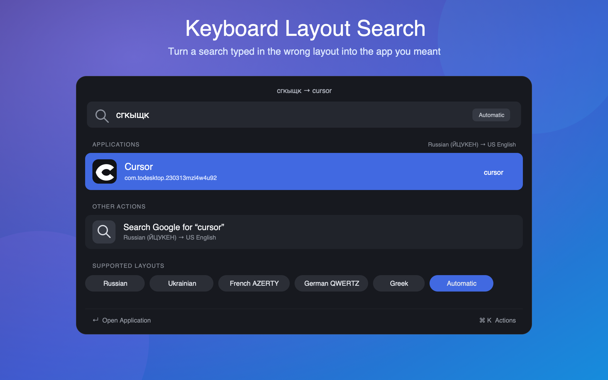

# Keyboard Layout Search

Fix a Raycast search typed with the wrong keyboard layout, then open the intended application or continue with the corrected text.

## Features

- Automatically detects Russian, Ukrainian, French AZERTY, German QWERTZ, and Greek input.
- Converts the physical keys to US English without sending text to an external service.
- Finds and ranks installed applications locally.
- Searches the web, copies, or pastes the corrected query when no application matches.
- Lets you choose a specific source layout in the extension settings when automatic detection is ambiguous.

Examples:

- `сгкыщк` → `cursor`
- `zoutube` → `youtube` on German QWERTZ
- `chro,e` → `chrome` on French AZERTY
- `ζοομ` → `zoom` on Greek

## Setup

1. Open Raycast Settings.
2. Go to **Launcher → Fallback Commands**.
3. Add **Fix Keyboard Layout**.

Now type a query in Root Search. When there is no regular result, select **Fix Keyboard Layout** to see matching applications and actions.

## Automatic Detection

Automatic mode uses the input script for Cyrillic and Greek text. For Latin layouts such as AZERTY and QWERTZ, it only applies a conversion when the result is a materially stronger match for an installed application. This avoids changing ordinary English web searches unexpectedly.

To force a layout, open **Raycast Settings → Extensions → Keyboard Layout Search → Source Keyboard Layout**.

## Supported Layouts

All conversions target the US English keyboard layout.

- Russian — ЙЦУКЕН
- Ukrainian — ЙЦУКЕН
- French — AZERTY
- German — QWERTZ
- Greek — Ελληνικά

## Privacy

Keyboard conversion and application matching happen entirely on your Mac. Text is only sent outside Raycast if you explicitly choose the Google Search action.
