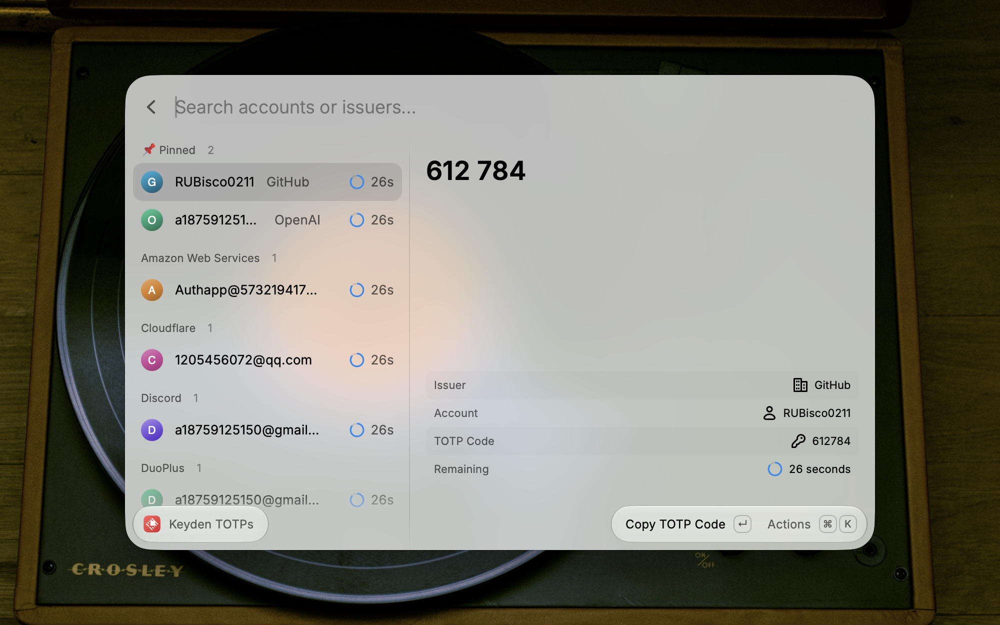

# Keyden for Raycast


A [Raycast](https://www.raycast.com/) extension for browsing, searching, and copying TOTP codes managed by [Keyden](https://github.com/tasselx/Keyden), a native macOS menu bar authenticator.

## Features

- **Grouped Accounts**: Browse TOTP accounts grouped by issuer.
- **Pinned Accounts**: Access pinned accounts from a dedicated section while keeping them in their issuer groups.
- **Instant Search**: Search across account names and issuers using Raycast's built-in search.
- **Live Countdown**: See the remaining validity period update every second with a color-coded progress indicator.
- **Account Details**: View the issuer, account name, current TOTP code, and remaining time in the detail panel.
- **Automatic Refresh**: Fetch a new code from Keyden when the current TOTP period expires.

## Prerequisites

- macOS 12 or later
- The [Keyden app](https://github.com/tasselx/Keyden), initialized with at least one TOTP account
- The `keyden` CLI installed from the Keyden app

The CLI is bundled with Keyden and is not installed separately. Set it up in this order:

1. Install Keyden with Homebrew:

    ```sh
    brew install --cask tasselx/tap/keyden
    ```

    Alternatively, download the latest DMG from the [Keyden releases page](https://github.com/tasselx/Keyden/releases).

2. Launch Keyden and add or import your TOTP accounts.
3. Open **Keyden Settings → General → CLI Tool** and click **Install**. Keyden will request administrator permission and install the bundled CLI at `/usr/local/bin/keyden`.

You can also right-click an account in Keyden and choose **Copy CLI Command**; Keyden will prompt you to install the CLI if it is not available.

The extension automatically looks for `keyden` in your `PATH`, `/usr/local/bin`, and `/opt/homebrew/bin`. If it cannot find the executable, it will prompt you to configure the full path in the command preferences.

## Commands

### List TOTP



Browse and search all TOTP accounts managed by Keyden.

- Select an account to view its current code and metadata.
- Press `Enter` to copy the TOTP code.
- Press `Cmd+R` to refresh all codes manually.

## Preferences

| Preference      | Description                                                                                     | Default |
| --------------- | ----------------------------------------------------------------------------------------------- | ------- |
| Keyden CLI Path | Full path to the `keyden` executable. Required only when it cannot be discovered automatically. | Auto    |

To find the executable path, run:

```sh
which keyden
```

Then enter the returned full path, such as `/usr/local/bin/keyden`, in the command preferences.

## Troubleshooting

- **Keyden CLI Path Required**: Open the command preferences and set the full path returned by `which keyden`.
- **Invalid or non-executable path**: Verify that the configured path points to the `keyden` executable rather than its containing directory.
- **No TOTP accounts**: Add an account in the Keyden app, then refresh the command.
- **Unable to load TOTPs**: Confirm that Keyden is initialized and that `keyden list` runs successfully in Terminal.

## Security

- TOTP codes are read locally from the Keyden CLI.
- The extension does not persist TOTP codes or account data.

## About Keyden

Keyden is an open-source macOS TOTP authenticator created by [tasselx](https://github.com/tasselx). It stores TOTP secrets in macOS Keychain and provides the CLI used by this extension.

- [Keyden repository](https://github.com/tasselx/Keyden)
- [Keyden releases](https://github.com/tasselx/Keyden/releases)

## License

MIT
