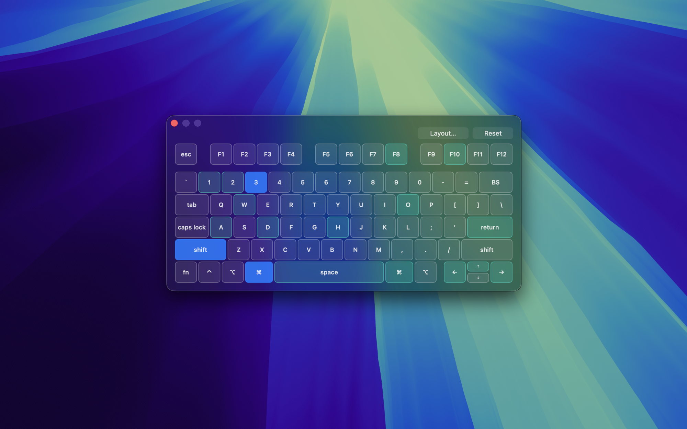
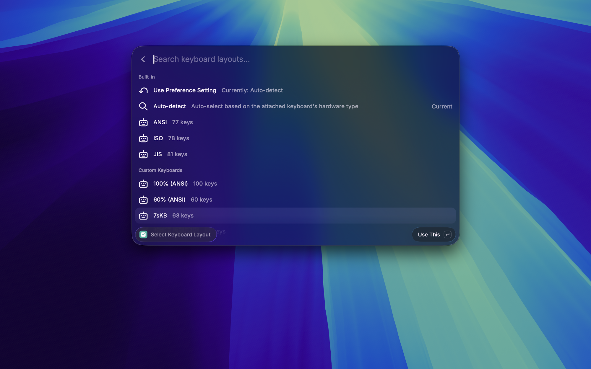
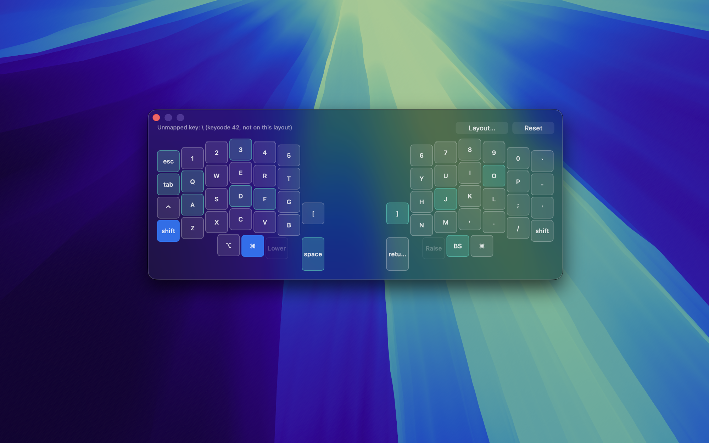

<p align="center">
  English | <a href="README.ja.md">日本語</a>
</p>

<p align="center">
  
</p>

<h1 align="center">KeyProbe</h1>

<p align="center">
  Test every key on your keyboard from Raycast.
  <br />
  A native, translucent panel that highlights each key as you press it — confirm a custom keyboard actually works at the OS level.
</p>



## Features

- Highlights a key while held, then marks it "tested" once released, so you can see at a glance which keys you haven't tried yet
- Built-in ANSI / JIS / ISO layouts, auto-detected from your attached keyboard's hardware type
- Currently 50+ bundled custom keyboard layouts (Corne, Lily58, Planck, HHKB, Keychron Q11, moNa2, Kinesis Advantage 360, and more), searchable via **Select Keyboard Layout**
- Keys with no fixed OS keycode (layer keys, media keys) are drawn as non-testable — after switching layers, press the key and confirm it actually types what you expect
- Reset button clears all state without closing the panel

## Setup

1. Run **Open KeyProbe** from Raycast
2. Grant **Input Monitoring** permission when prompted, then run the command again

> [!IMPORTANT]
> The first run needs **Input Monitoring** permission (not Accessibility). Grant it in System Settings → Privacy & Security → Input Monitoring by enabling `KeyProbeHelper`, then run **Open KeyProbe** again. Without this, the panel opens but never lights up.

## Choosing a layout

<p align="center">
  
  
</p>

- The **Keyboard Layout** preference sets the default: Auto-detect, ANSI, JIS, or ISO
- **Select Keyboard Layout** searches all bundled layouts — including the custom keyboards — and switches live, even while the panel is open

> [!NOTE]
> Auto-detect reads the physically attached keyboard's *hardware type*, not your macOS input source language. An ANSI-shaped board stays "ANSI" even if its firmware sends JIS key combos; pick JIS explicitly to test those.

## Known limitations

> [!WARNING]
> Hardware media/volume/brightness keys arrive as a different event type this tool doesn't capture, so they won't register at all — not even as an unmapped key.

- Small ZMK-firmware layouts like cornix couldn't have their default keymap auto-parsed (heavy macro use), so their layout was built from a reference image of the actual default keymap instead. To test a key that isn't shown on the board, check the unmapped-key readout at the top of the panel, or switch to another Keyboard Layout such as the 100% (ANSI) full-size board

## Adding a custom keyboard layout

Bundled boards are converted from QMK/ZMK firmware sources using the scripts in `tools/`:

```bash
# QMK boards (keyboard.json/info.json + keymap.c or keymap.json)
python3 tools/qmk_to_layout.py \
  --keyboard-json <qmk_firmware>/keyboards/<board>/keyboard.json \
  --keymap <qmk_firmware>/keyboards/<board>/keymaps/default/keymap.json \
  --name "My Board" --out assets/layouts/myboard.json

# ZMK boards (a physical layout JSON + a .keymap DTS file)
python3 tools/zmk_to_layout.py \
  --geometry <zmk-config>/config/myboard.json --layout-name default_layout \
  --keymap <zmk-config>/config/myboard.keymap \
  --name "My Board" --out assets/layouts/myboard.json
```

Drop the resulting JSON into `assets/layouts/` — it's picked up automatically by the search UI, no code changes needed. Run each script with `--help` for the full set of options.
