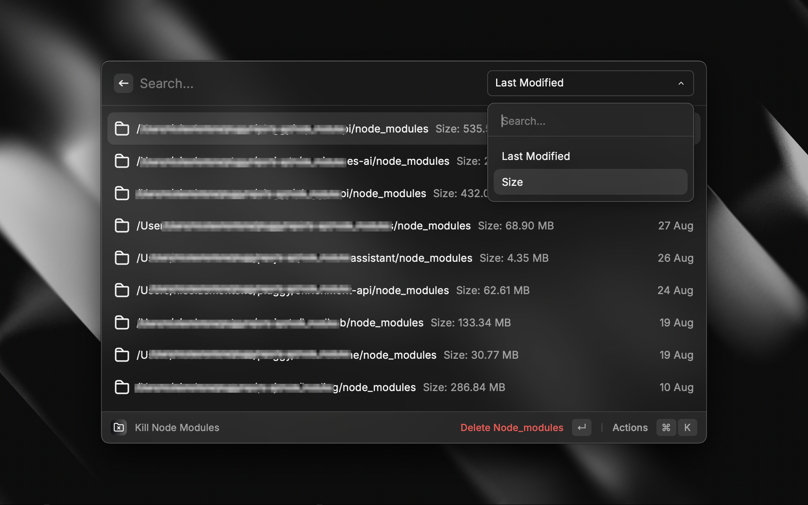

# Kill Node Modules

Easily find and delete `node_modules` folders to reclaim disk space. This extension scans a directory of your choice, lists all found `node_modules` folders, allows you to sort them by size or last modified date, and delete them with a simple action.

## Features

- **Discover `node_modules`**: Scans a user-defined root folder and depth for `node_modules` directories.
- **Detailed Listing**: Shows the full path, size, and last modified date for each `node_modules` folder.
- **Sortable Results**: Easily sort the found folders by their size or by their last modified date to identify the largest or oldest ones.
- **Quick Deletion**: A simple action to delete selected `node_modules` folders.
- **Safety Confirmation**: Prompts for confirmation before deleting to prevent accidental data loss.
- **Finder Integration**: Option to quickly open the parent folder of a `node_modules` directory in Finder.

## Configuration

Before using the "Kill Node Modules" extension, you'll need to configure a couple of preferences. Raycast will prompt you for these when you first run the command if they are not set.

You can access and modify these settings at any time via Raycast preferences:

1. Open Raycast (`⌥ + Space` by default).
2. Type "Extensions".
3. Find "Kill Node Modules" in the list.
4. Go to the "Preferences" tab on the right, or use the action `⌘ + ,` (Configure Extension).

### Required Preferences:

1.  **Root Folder**:

    - **Description**: This is the starting directory where the extension will begin its scan for `node_modules` folders. For example, you might set this to your main development projects folder, like `~/Developer`, `~/Code`, or `~/Sites`.
    - The extension cannot operate without this path being set.

2.  **Scan Depth**:
    - **Description**: This number defines how many levels of subdirectories the extension will search into, starting from the "Root Folder".
      - A smaller number (e.g., `2` or `3`) will result in a faster scan but might miss `node_modules` in deeply nested project structures.
      - A larger number (e.g., `5` or more) will be more comprehensive but may take significantly longer to complete, especially if the root folder contains many subdirectories.
    - Choose a value that balances thoroughness with scan speed for your typical project structure.

## Screenshots

