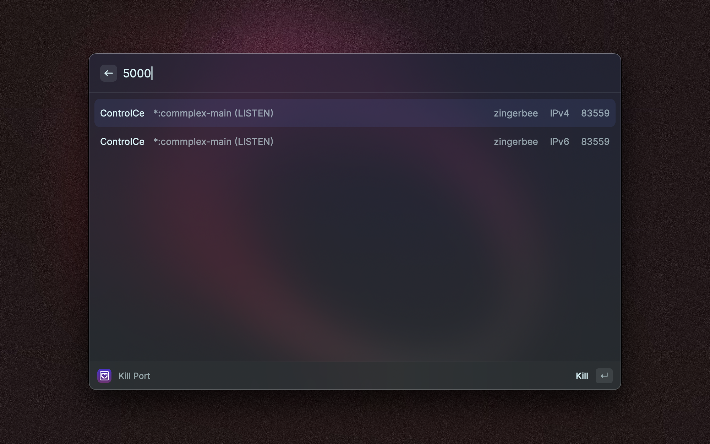

# Kill Port - Raycast Extension
Release port occupation

## Getting Started
1.	Enter the port number of the process you wish to terminate. (This action will list all running processes on the specified port.)
2.	Choose a process from the listed ones on this port.
3.	Press `Enter` to terminate the selected process.

## Snapshots
