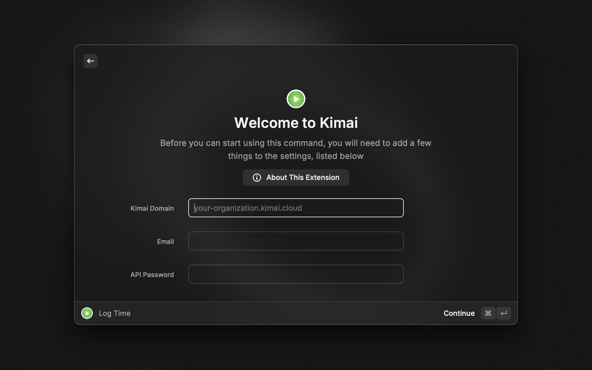

# Kimai

This [Raycast](https://raycast.com) extension lets you quickly add new time log to [Kimai](https://www.kimai.org) and view amount of hours logged today in menu bar.

## Features

- Create new time log
- View amount of hours logged today in menu bar

## Setup

To connect the extension to your Kimai instance you need to add the following settings.

- **Request protocol:** Protocol to be used to make API requests. If you are using local (self hosted) Kimai, set it to 'http', otherwise keep it as 'https'.
- **Kimai Domain:** The domain of your Kimai instance like `your-organization.kimai.cloud`.
- **Email:** Email you use to login into Kimai
- **API Password:** Password different from password you use to login into Kimai. You need to create it in your `API Access` settings.
- **Default time log duration (in minutes):** Duration that will be used to prepopulate duration field when adding new time log

You can find your settings by going to `https://{your-organization}.kimai.cloud/en/profile/{your-email}/api-token` or

1. Open Kimai dashboard
2. Click on your username
3. Open `Password`
4. Open `API Access`
