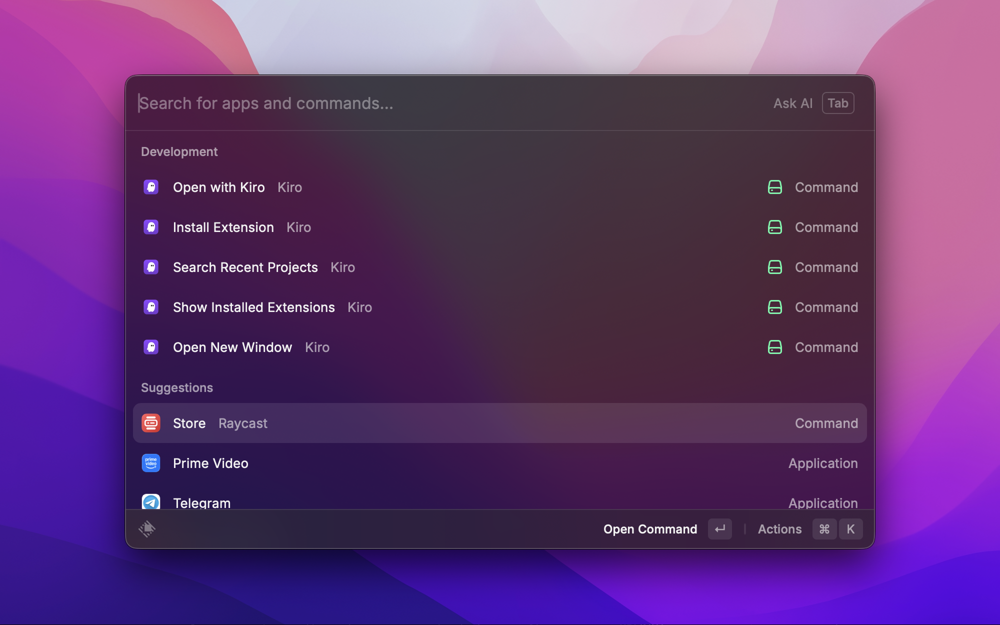
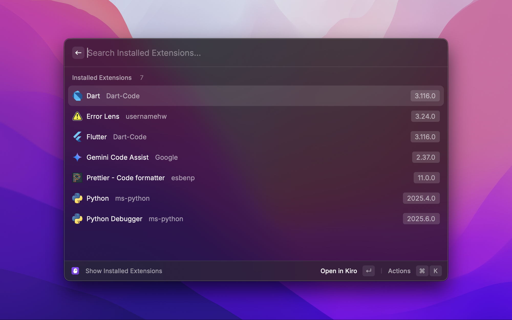
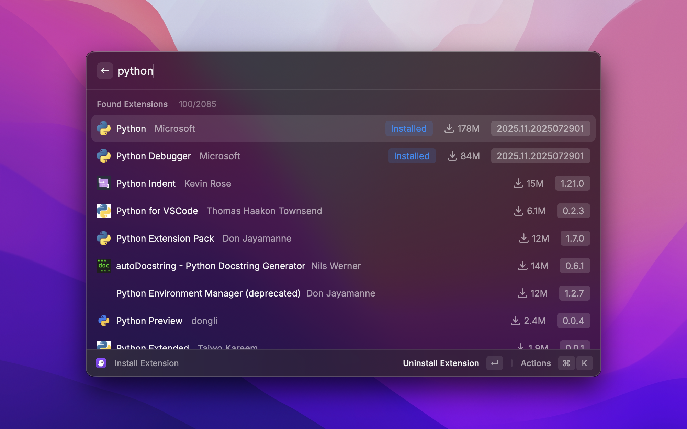

# Kiro Raycast Extension

Control Kiro directly from Raycast.





## Features

- **Search Recent Projects**: Browse and open recent projects from Kiro
- **Open with Kiro**: Open selected Finder items with Kiro
- **Open New Window**: Open a new Kiro window
- **Manage Extensions**: View, install, and uninstall Kiro extensions

## Commands

### Search Recent Projects

Browse through your recent Kiro projects with search and filtering capabilities. Pin important projects for quick access.

### Open with Kiro

Open the currently selected Finder or Path Finder items with Kiro. If no items are selected, opens the current directory.

### Open New Window

Open a new Kiro window using AppleScript automation.

### Show Installed Extensions

View all installed Kiro extensions with details like version, publisher, and installation date.

### Install Extension

Search and install extensions from the Kiro marketplace.

### Commands

Execute Kiro command palette commands directly from Raycast (requires Raycast for Kiro extension).

## Keyboard Shortcuts

This extension provides convenient keyboard shortcuts for quick access:

- **⇧⌥K** (`Shift+Option+K`) - Open New Window
- **⌥K** (`Option+K`) - Open with Kiro (opens selected Finder item)
- **⌘⌥K** (`Cmd+Option+K`) - Search Recent Projects

## Preferences

- **Build**: Select which build of Kiro to use
- **View Layout**: Choose between list and grid layouts
- **Keep Section Order**: Maintain section order during search
- **Close Other Windows**: Close other Kiro windows when opening projects
- **Terminal App**: Select which terminal app to use
- **Git Integration**: Show Git branch information
- **Git Branch Color**: Customize Git branch tag colors

## Requirements

- macOS
- Kiro Code Editor
- Raycast

## Installation

1. Install the extension from Raycast
2. Configure your preferences
3. Start using Kiro from Raycast!

## Development

```bash
# Install dependencies
npm install

# Start development
npm run dev

# Build extension
npm run build

# Lint code
npm run lint
```

## License

MIT License

Copyright (c) 2025 Jyothish Ram

Permission is hereby granted, free of charge, to any person obtaining a copy
of this software and associated documentation files (the "Software"), to deal
in the Software without restriction, including without limitation the rights
to use, copy, modify, merge, publish, distribute, sublicense, and/or sell
copies of the Software, and to permit persons to whom the Software is
furnished to do so, subject to the following conditions:

The above copyright notice and this permission notice shall be included in all
copies or substantial portions of the Software.

THE SOFTWARE IS PROVIDED "AS IS", WITHOUT WARRANTY OF ANY KIND, EXPRESS OR
IMPLIED, INCLUDING BUT NOT LIMITED TO THE WARRANTIES OF MERCHANTABILITY,
FITNESS FOR A PARTICULAR PURPOSE AND NONINFRINGEMENT. IN NO EVENT SHALL THE
AUTHORS OR COPYRIGHT HOLDERS BE LIABLE FOR ANY CLAIM, DAMAGES OR OTHER
LIABILITY, WHETHER IN AN ACTION OF CONTRACT, TORT OR OTHERWISE, ARISING FROM,
OUT OF OR IN CONNECTION WITH THE SOFTWARE OR THE USE OR OTHER DEALINGS IN THE
SOFTWARE.
