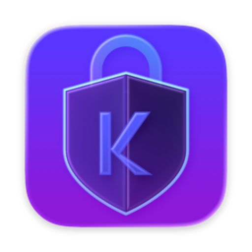

# Kloak Password Manager — Raycast Extension

  

A fast, local-first Raycast extension for **Kloak Password Manager**. Access, generate, and autofill credentials instantly from your keyboard with native macOS performance.

## Features

- 🔍 **Search Vault**: Instant search and filter across all logins, secure notes, credit cards, identities, email aliases, and authenticators.
- 📋 **Auto-Clearing Clipboard**: Copy passwords or 2FA codes with customizable auto-clear timer to protect clipboard privacy.
- 🎲 **Password Generator**: Generate high-entropy passwords or memorable EFF wordlist passphrases.
- ⏱️ **Built-in Authenticator**: Real-time 2FA codes (TOTP & HOTP) with live progress countdown indicators.
- ➕ **Add Entry**: Quickly save new logins, notes, and cards without leaving Raycast.
- 🔒 **Lock Vault**: Instantly wipe in-memory keys and secure your vault.
- 🔄 **Import & Export**: Seamlessly import credentials from 1Password, Bitwarden, LastPass, Apple Passwords, and Chrome; export to Bitwarden JSON or encrypted Kloak backups.

## Requirements

- macOS 14.0+ (Sonoma or later recommended)
- Kloak macOS Desktop App or Daemon

## License

MIT License — Copyright (c) 2026 Kloak Security
