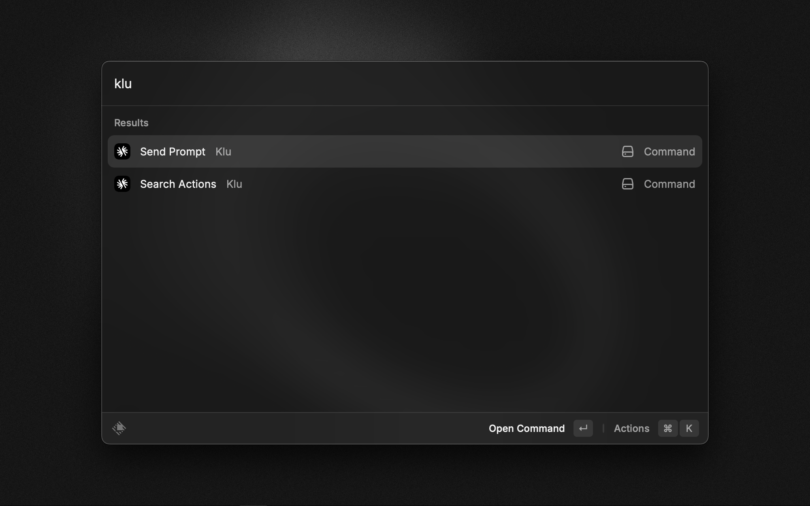

<h1 align="center">Klu.ai</h1>

<!-- <h3 align="center">
The Klu.ai Raycast extension allows you to interact with the Klu.ai to search and send prompts to your action.
</h3> -->

# Features

### Search and explore actions

### Send prompt to your action

# How to use

This package requires a valid `API Key` from [klu.ai](https://app.klu.ai).

> All the preferences value will be stored locally using [Preferences API](https://developers.raycast.com/api-reference/preferences)
