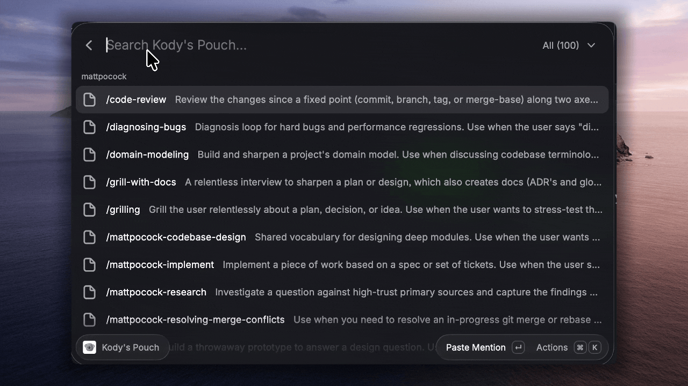

# Kody's Pouch

Your Kody Skills and Tools, one command away.

Kody is the source of truth for your Skills and Tools. Coding harnesses do not list them, so the editor has no autocomplete. You talk to an agent, which means you only reach what you already remember to ask for.

The Pouch makes that inventory visible. Open one Raycast command, search, and paste a Mention or Skill Contents into the Active Input. If paste is unavailable, use Copy Mention or Copy Contents.

This extension does not read disk skills or write stubs.

## Setup

The Pouch calls one inbound webhook on a Discovery Package. Installers own their copy and webhook URL. Treat the URL as a credential.

The Skills list loads from a published `skills` Package in your account. Your Discovery Package finds that Package by `kody.id` and loads Skill Contents through the `pouch` webhook's `get-skill` operation. If the `skills` Package is missing, the Pouch still shows Tools.

1. Install **Kody's Pouch** from the Raycast Store. To run the source instead, clone this repository, then run `npm install && npm run dev`.
2. For Skills, fork [Kent's skills Listing](https://kody.codes/@kentcdodds/skills), review it, and privately publish your copy with `kody.id` set to `skills`.
3. Fork the [Kody's Pouch Discovery Package](https://kody.codes/@cameronpak/raycast-kodys-pouch), review it, and publish your copy.
4. Open `https://kody.codes/@<username>/raycast-kodys-pouch/settings#webhooks` with your Kody username in the path.
5. Mint and copy the `pouch` webhook URL. Do not paste it into chat or commit it.
6. Open **Kody's Pouch** in Raycast. Set your Kody username, paste the URL into the Pouch Webhook URL password preference, and keep Discovery Package Kody ID as `raycast-kodys-pouch`.

If you already use the five legacy URLs, update and publish your Discovery Package fork, mint `pouch`, then replace those preferences with the one Pouch Webhook URL.

## Use

Open **Kody's Pouch**. Type to filter, or narrow the Scope dropdown to Skills, Tools, or one Parent. Pick a row. The Mention pastes at the caret. Use Copy Mention or Copy Contents for the clipboard. Skills also offer Paste Contents (⇧↩).

Pin a row with ⌘⇧P to keep it in a Pinned section above Recent. Refresh Pouch (⌘R) revalidates the inventory.
