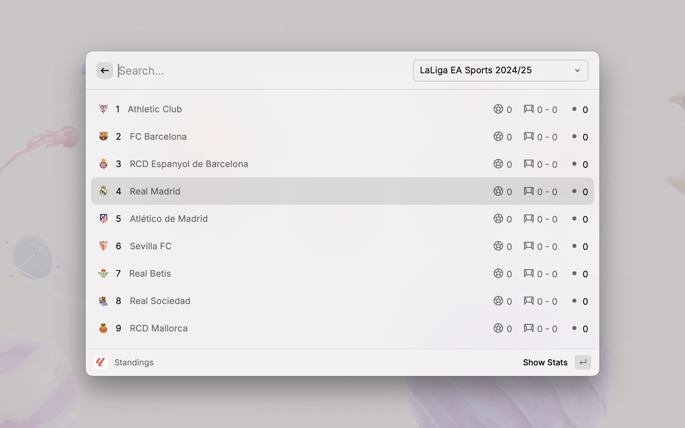

  <h1 align="center">LaLiga</h1>

A comprehensive extension for tracking La Liga matches, standings, and club information.

### **Key Features**

* **Standings:** View the current league table, including points, goal difference, and head-to-head records.
* **Results:** Access detailed match results, including scores, goalscorers, match highlights, and lineups.
* **Clubs:** Explore information about individual teams, including their history, squad, recent matches, and key players.
* **Match Information:** Dive deeper into matches with insightful comments, lineups, and analysis.
* **Dynamic Seasons List:** Easily navigate through different seasons to view historical data.
* **Other Competitions:** Explore other football leagues beyond La Liga, such as UEFA Champions League, Europa League, and domestic leagues.

## Issues

Report bugs or suggest improvements by creating an issue [here](https://github.com/anhthang/raycast-laliga/issues).
