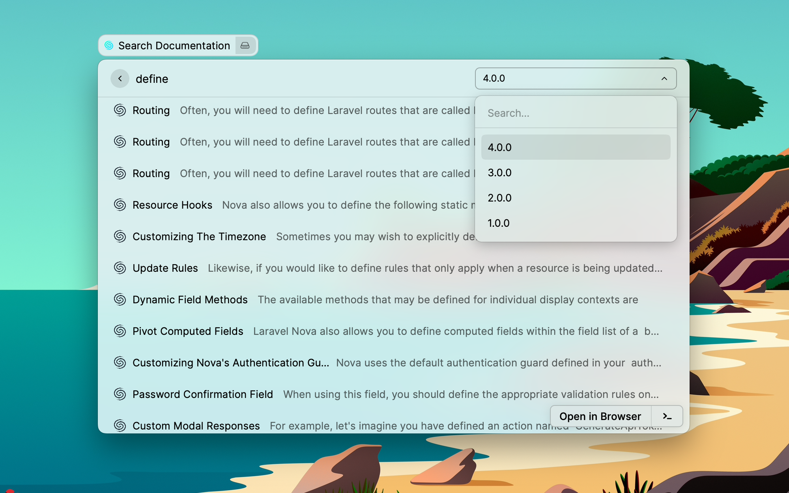

# Laravel Nova Extension

Search through Laravel Nova documentation directly from raycast.

Relies on a mix of static sections seen for each version of nova on the site
as well as searching against their algolia index.

## Developer Instructions

### 🧱 Requirements
- Raycast >= 1.32.0
- Node.js >= 16.10
- npm >= 7.0

### 💻 Usage
1. npm install
2. npm run dev
3. This will open Raycast, add the extension and listen for any logs

## Credits
Heavily inspired by the Laravel Docs and Laracasts Raycast Extensions.

## License
This Raycast Extension is open-sourced software licensed under the [MIT license](https://opensource.org/licenses/MIT).

