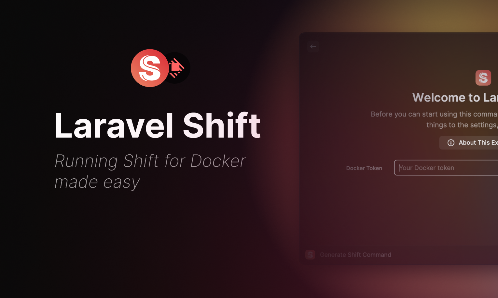

# Laravel Shift for Docker

_Generate any of the Docker Shifts for Laravel, Lumen, PHP, Django, and Tailwind using Raycast._

## Laravel Shift
[Laravel Shift](https://laravelshift.com/) is a time-saving, automated tool designed to upgrade, refactor, and analyze Laravel applications. By streamlining the process of maintaining and modernizing your Laravel projects, Laravel Shift enhances developer productivity and ensures your applications stay up-to-date.

This [Raycast](https://www.raycast.com/) extension allows you to **generate** any of the Docker Shifts for Laravel, Lumen, PHP, Django, and Tailwind.
See te official [Running Shift
for Docker](https://laravelshift.com/docker/install) docs for installation and setup.

## Requirements

- A Shift Docker Token is required to complete the setup step.

## Usage

- Open Raycast and search for "Laravel Shift for Docker"
- Search for a shift you want to generate
- Press ⌘ + ↵ (command + enter)
- The generated shift will be copied to your clipboard

## Settings

Within the Extension settings (⌘+⇧+,) you can set the following: 
- Shift Docker Token
- Git Author Name & Email
- Mount option
- Whether to clos the Raycast window after copying the generated shift