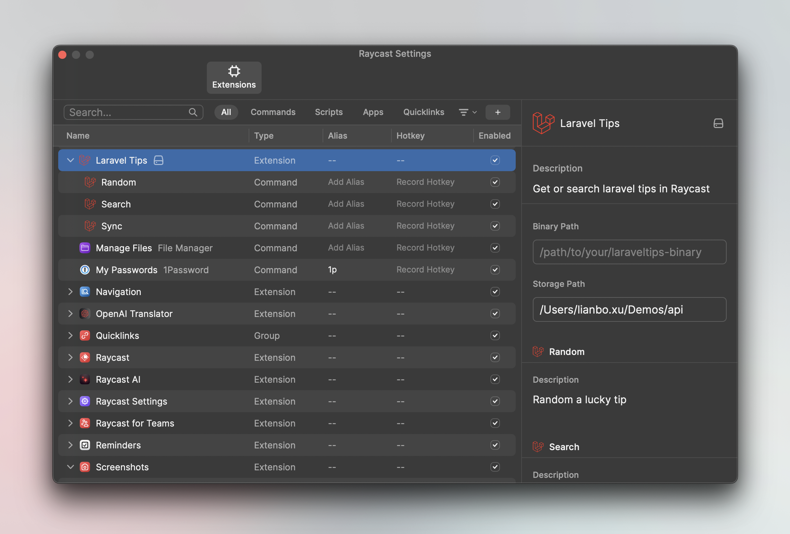

<h1>Laravel Tips In Rasycast</h1>

# Features

- ✅ Lucky tips randomly
- ✅ Search tips by keyword
- 👀 Use SQLite FT5 support full-text search

### Lucky tips

### Tips Search

# How to use

This extension is required [godruoyi/laravel-tips](https://github.com/godruoyi/laravel-tips) project. we use the built-in `laraveltips` by default, you can also install it manually and configure the `Binary Path` in the extension settings.

