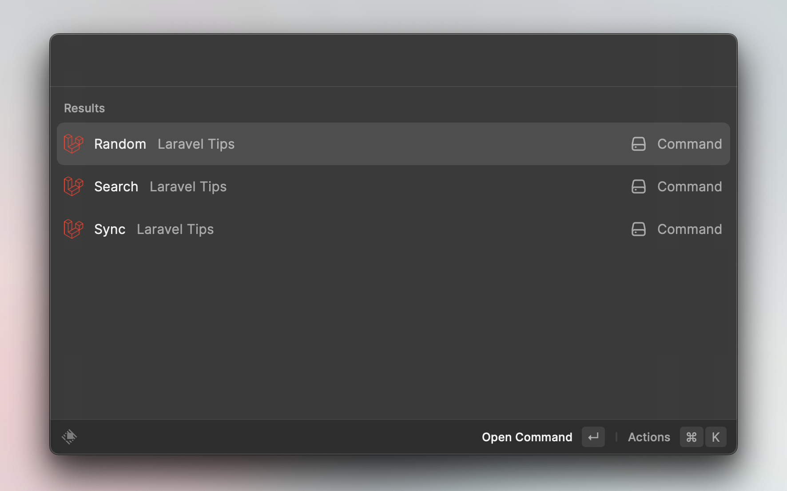
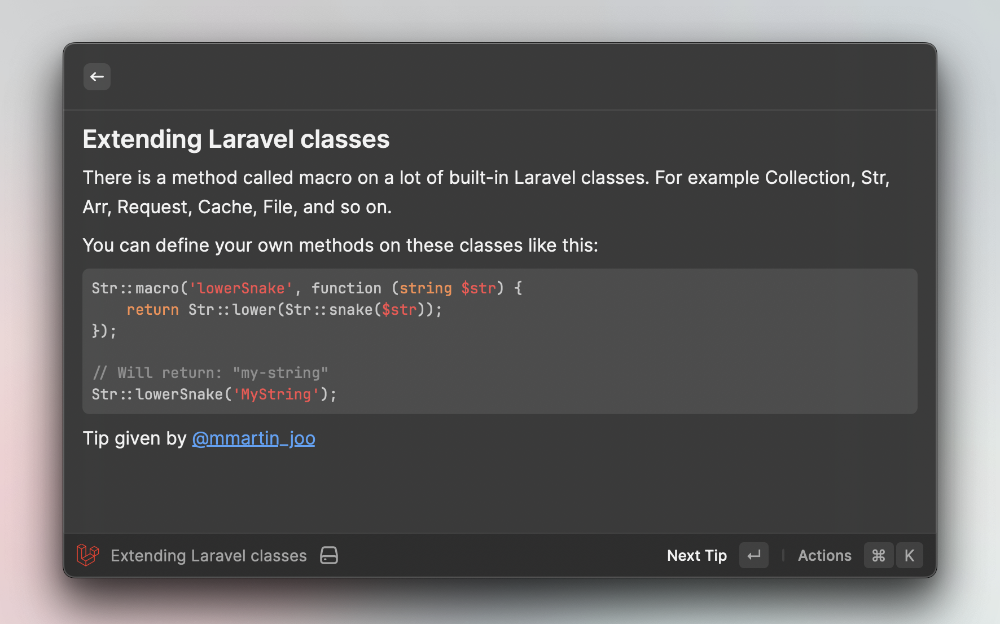
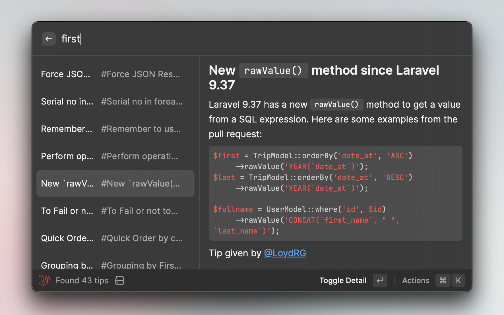
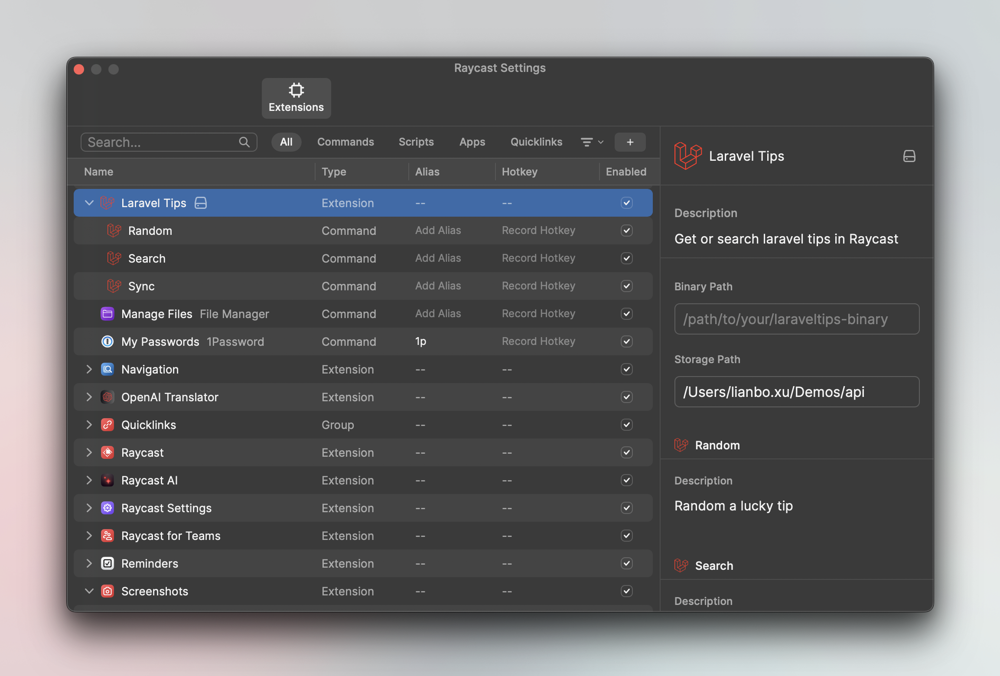

<h1>Laravel Tips In Rasycast</h1>

## Features

- ✅ Lucky tips randomly
- ✅ Search tips by keyword
- 👀 Use SQLite FT5 support full-text search
- 👀 Remove built-in `laraveltips` and download it from [godruoyi/laravel-tips](https://github.com/godruoyi/laravel-tips)
  automatically

### Lucky tips

### Tips Search

## How to use

This extension is required [godruoyi/laravel-tips](https://github.com/godruoyi/laravel-tips) project. we use the
built-in `laraveltips` by default, you can also install it manually and configure the `Binary Path` in the extension
settings.

## Development

Clone this repo and install it locally in developer mode.

You will need to have [Node.js](https://nodejs.org) and [pnpm](https://pnpm.io/) installed.

1. Clone this repo `git clone https://github.com/godruoyi/laravel-tips-raycast.git`
2. Go to the folder `cd laravel-tips-raycast`
3. Install dependencies `npm install && npm run dev`
4. Go to Raycast, run `Import Extension` and select the folder

## FQA

- Q: 403 Forbidden, API rate limit exceeded for your IP address.
- A: We use the GitHub API to retrieve the latest Laravel tips data. If you encounter this issue, please refer to the
  GitHub [documentation](https://docs.github.com/rest/overview/resources-in-the-rest-api#rate-limiting) to solve it. you
  can create a personal access token and set it to the extension settings.

## License

MIT License

