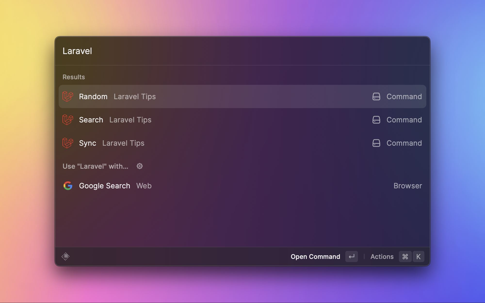
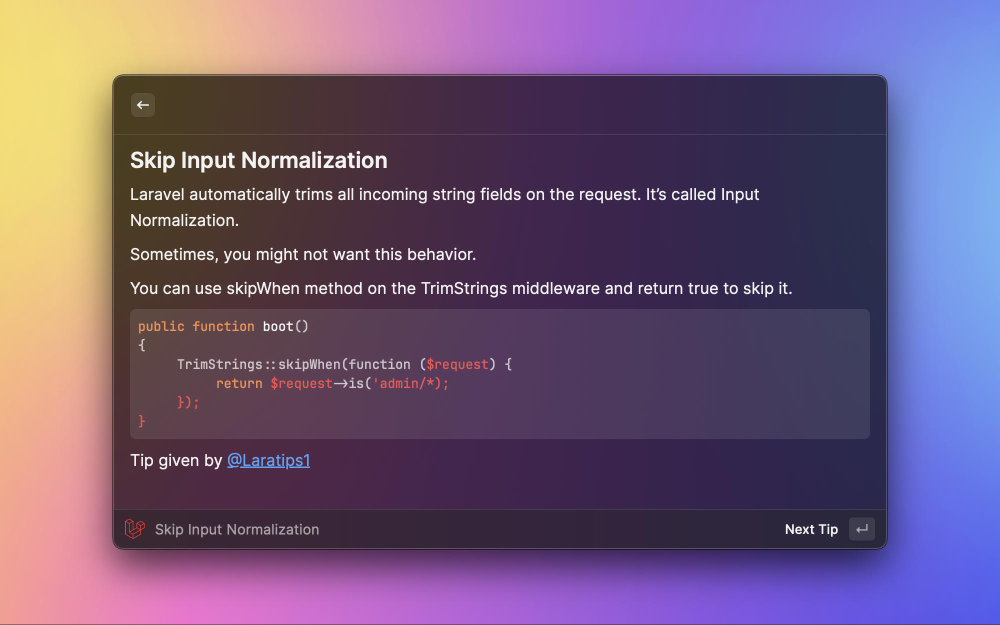
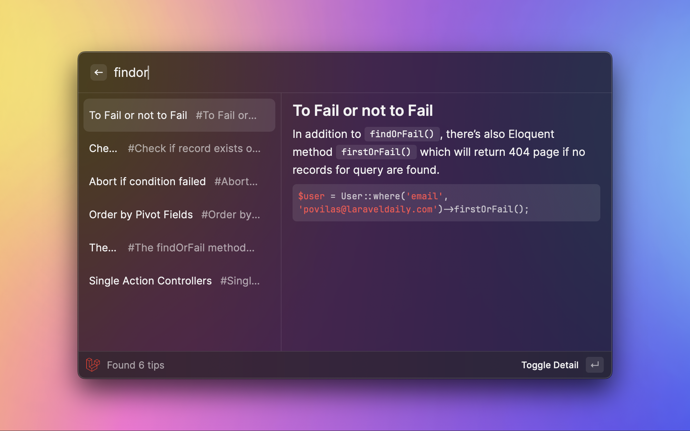
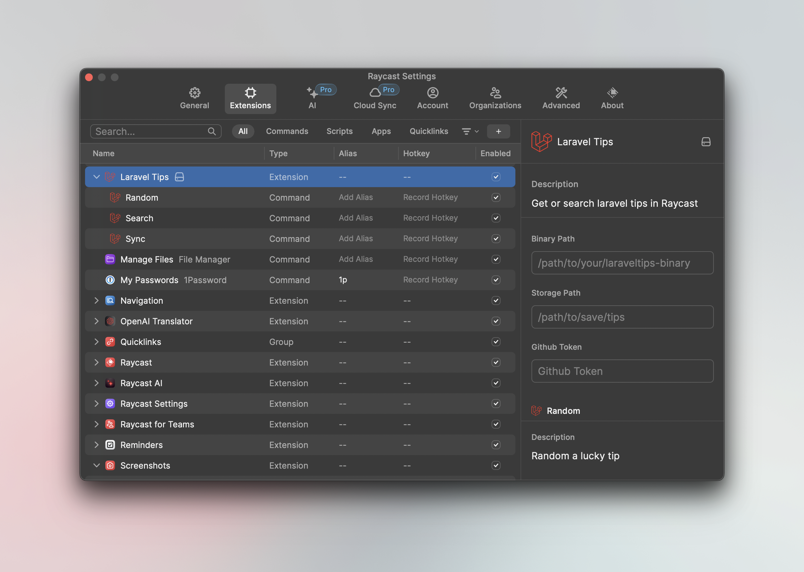

<h1>Laravel Tips In Rasycast</h1>

## Features

- ✅ Lucky tips randomly
- ✅ Search tips by keyword
- 👀 Use SQLite FT5 support full-text search

### Lucky tips

### Tips Search

## How to use

This extension is required [godruoyi/laravel-tips](https://github.com/godruoyi/laravel-tips) project. we use the
built-in `laraveltips` by default, you can also install it manually and configure the `Binary Path` in the extension
settings.

## Development

Clone this repo and install it locally in developer mode.

You will need to have [Node.js](https://nodejs.org) and [pnpm](https://pnpm.io/) installed.

1. Clone this repo `git clone https://github.com/godruoyi/laravel-tips-raycast.git`
2. Go to the folder `cd laravel-tips-raycast`
3. Install dependencies `pnpm install`
4. Go to Raycast, run `Import Extension` and select the folder

## License

MIT License

