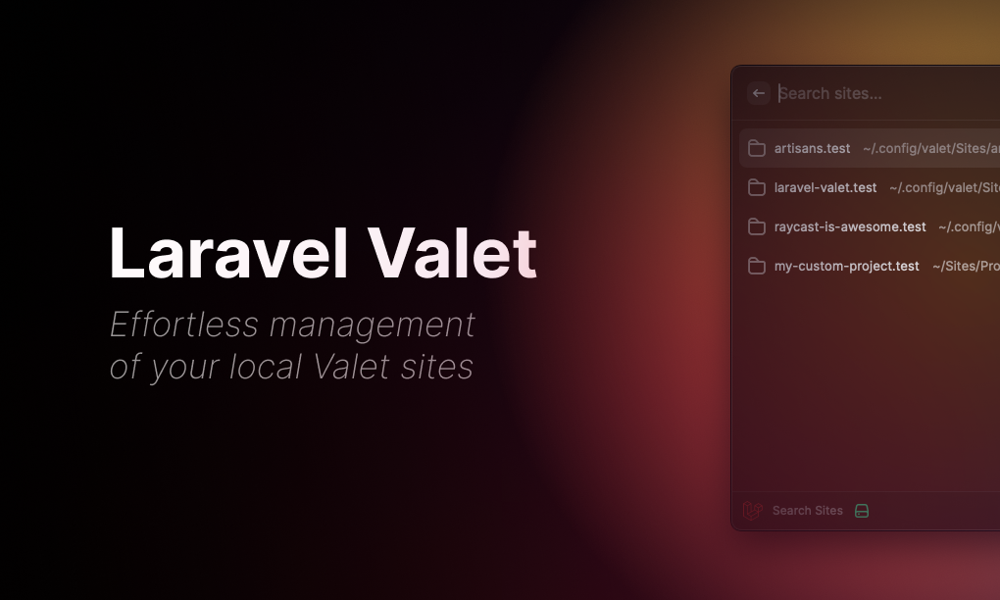

# Raycast - Laravel Valet
_Effortless management of your local Valet sites_

## Usage
- Open Raycast and search for "Laravel Valet"
- Search for a site you've parked with Valet
- Press enter on the selected site to open it in your browser
- Press `cmd + k` to see available Valet actions

## Features
- Search through all your parked sites
- Open selected site in browser
- Show selected site in Finder
- Open selected site in other apps
- Copy selected site path to clipboard
- Start/Stop/Restart Valet
- View log files

... and more to come! 🚀

## Note
- Many of the features require sudo privileges, so you will need to have run `valet trust` in your terminal before using them.
