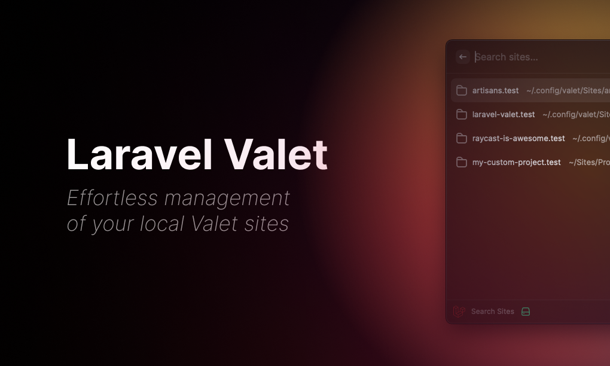
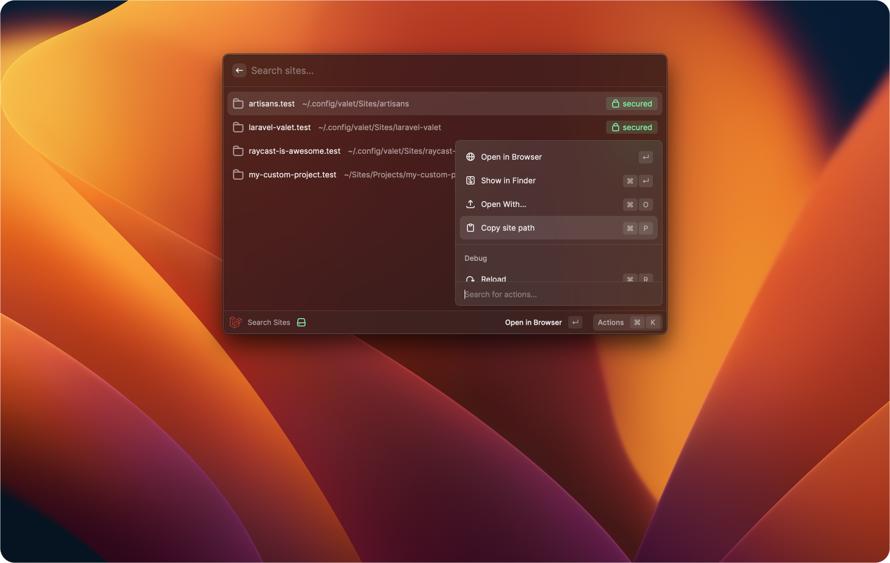

# Raycast - Laravel Valet
_Effortless management of your local Valet sites_

## Usage
- Open Raycast and search for "Laravel Valet"
- Search for a project you've parked with Valet
- Press enter on the selected project to open it in your browser

## Features
- Search through all your parked projects
- Open selected project in browser
- Show selected project in Finder
- Open selected project in other apps
- Copy selected project path to clipboard

... and more to come! 🚀

## Showcases
**Open a project in your browser**
    

**Multiple actions for a project**
