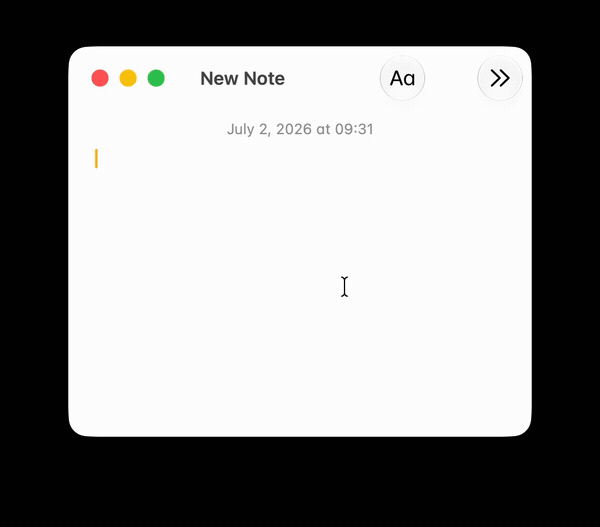

# Layout Switcher

Fix text typed with the wrong keyboard layout — convert it between a Cyrillic
layout (Russian, Ukrainian or Belarusian) and English (QWERTY), on demand.

`ghbdtn` → `привет` &nbsp;&nbsp;•&nbsp;&nbsp; `руддщ` → `hello`



It does **one thing**: rewrites the text in place. It does not switch your
system keyboard layout (input source) and ships **no native binaries** — just a
small, dependency-light command. The direction (Cyrillic→EN or EN→Cyrillic) is
detected automatically.

## Command

**Convert Layout (Cyrillic ↔ EN)** — one smart command:

1. If text is **selected**, it converts the selection.
2. If nothing is selected, it presses **Cmd+A** and converts the **whole field**.
3. The direction is detected **automatically** from the content: mostly Cyrillic
   means you wanted Latin, and vice versa.

The result is pasted over the selection. Assign a hotkey in Raycast (for example
`⌥⇧L`) for instant fixes.

## Layouts

Pick the Cyrillic layout you type with in the command preferences:

- **Russian**
- **Ukrainian** (і ї є ґ)
- **Belarusian** (ў і)

The key maps are dumped straight from the macOS system layouts (Carbon
`UCKeyTranslate`), so they match Apple's layouts exactly — **not** the Windows
ЙЦУКЕН layout. On macOS `ё` sits on the `\` key, `/` stays `/`, and the shifted
number row differs.

## Permissions

The command simulates keystrokes and reads the current selection, so on first run
macOS will ask for **Accessibility** (and **Automation → System Events**) in
System Settings → Privacy & Security.

## Development

```bash
npm install
npm run dev        # ray develop — the extension appears in Raycast
```

## Build / publish

```bash
npm run build      # ray build
npm run publish    # publish to the Raycast Store
```

## How it works

`src/layout.ts` holds the QWERTY ↔ Cyrillic key maps for each layout (by physical
key position, including Shift variants and punctuation) and the direction
detection. `src/convert-layout.ts` is the command logic (read the layout
preference / selection / Cmd+A / paste).
