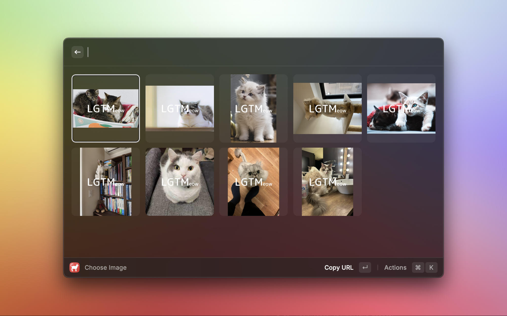

# Raycast Extension for LGTMeow

This is a Raycast extension that allows you to easily select and paste cat images from LGTMeow (https://lgtmeow.com/) as LGTM images in Markdown format.

LGTMeow is a website that collects cat images that can be used as LGTM images. This extension utilizes the LGTMeow API to display a selection of cat images, allowing you to choose one and obtain its link in Markdown format.
