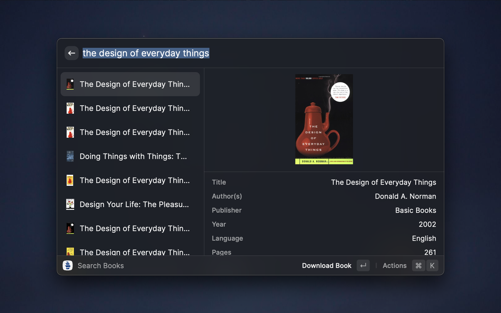
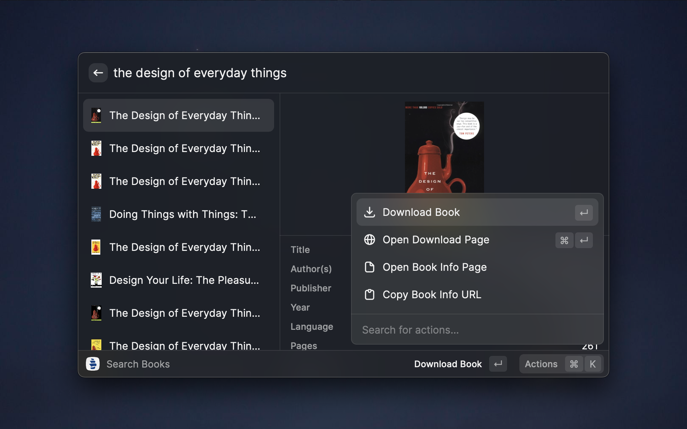
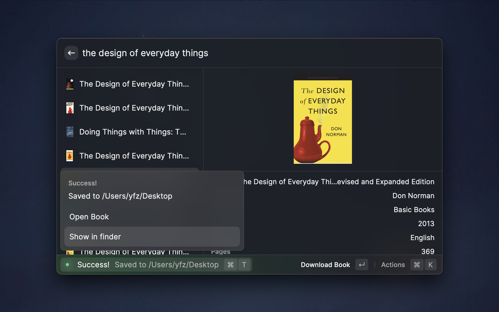

  
  <h1 align="center">Library Genesis</h1>

  

A [Raycast](https://raycast.com/) extension that lets you search books on Library Genesis and allows you to quickly view them and directly download them.

   <video src="https://user-images.githubusercontent.com/24559576/209476646-8c9fc1c7-e035-4ab1-b7e3-ebbe54c9c5b4.mp4" />

## Features

### Search Books

The extension sends query directly to the fastest mirror of Library Genesis. It then presents all the results with their book covers to help you quickly identify the desired book you are looking for.

### Direct Download

The extension allows you to quickly download the book file to your local machine with a single click.

You can choose either to save it in a default directory, or to specify the directory every time, by configuring the extension.

### Preferred Languages

The extension allows you to set your preferred languages and prioritize the results of those languages.

For example, if your preferred language is set to `Chinese, English`, the extension will show you all the Chinese books first, and English second, and then others. In this case, even when you are searching in other languages, the results keep your preferred ones on top, so that you don't miss out.
