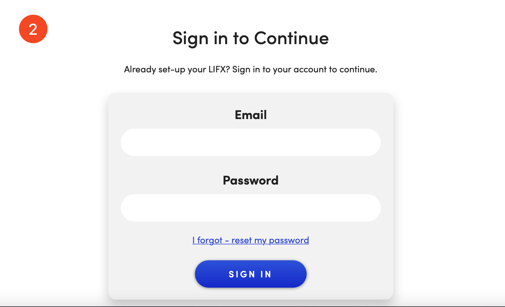
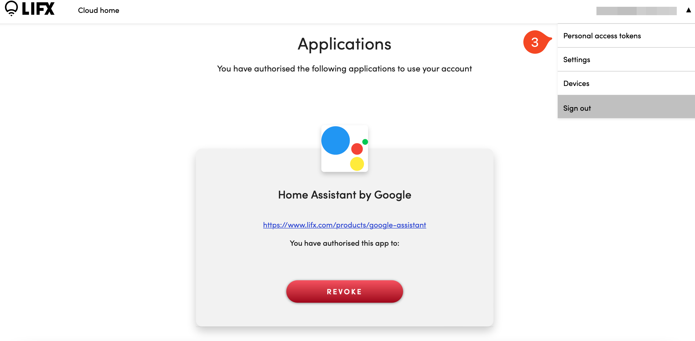
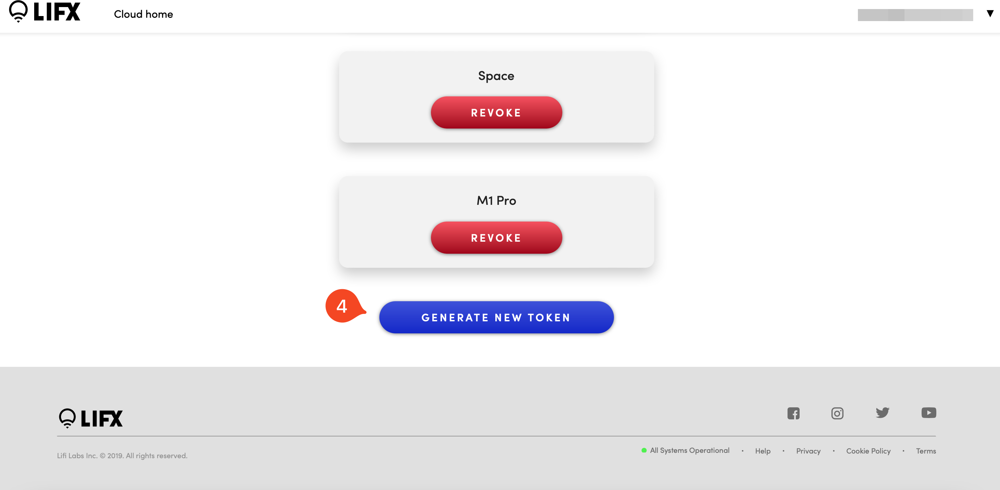
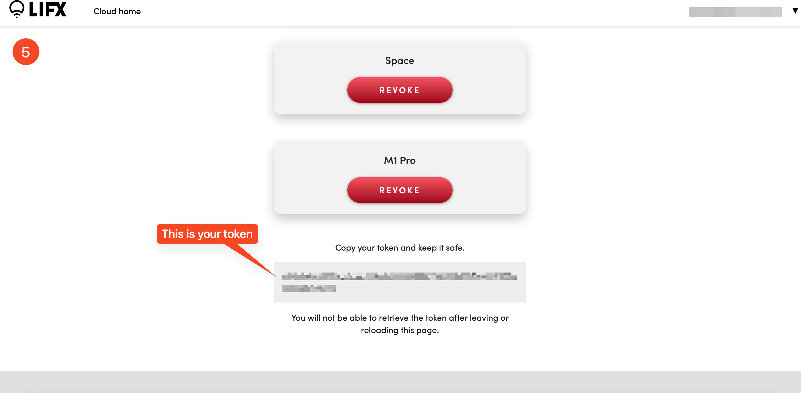

# LIFX
Control your lifx lights right in raycast

## Step 1:
Go to [cloud.lifx.com](https://cloud.lifx.com)

## Step 2:
Login with the account you want to control the lights with

## Step 3:
Open the menu and go to Personal accses tokens

## Step 4:
Click generate new token and enter a name for your token.
Forexample "Raycast"

## Step 5:
Copy your token and paste in the extension configuration

