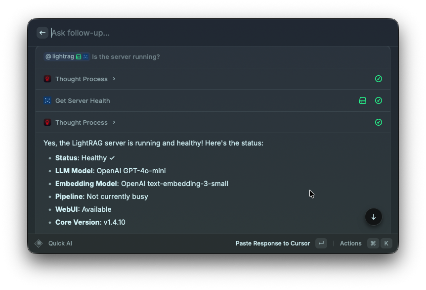
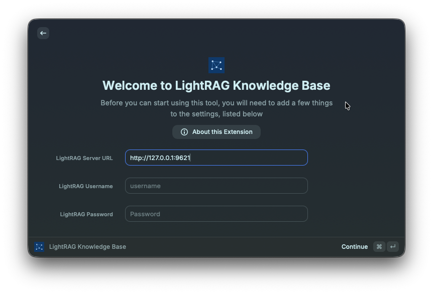

# LightRAG Knowledge Base

Raycast extension for your **self-hosted [LightRAG](https://github.com/HKUDS/LightRAG)** server: query a graph-based RAG knowledge base, inspect documents and pipeline status, explore the knowledge graph, and use Raycast AI tools against your own data.

You run LightRAG on your machine or network; this extension only connects to **your** server URL and credentials.



## Requirements

- macOS with [Raycast](https://raycast.com/)
- A running LightRAG instance (see the upstream project for installation and configuration)
- Network access from your Mac to that server (e.g. `http://127.0.0.1:<port>` for local installs)

## Setup

1. Open Raycast → **Extensions** → **LightRAG Knowledge Base** → **Preferences** (or the extension’s settings).
2. Set **LightRAG Server URL** to your API base URL, including protocol and port (example: `http://127.0.0.1:9621` — use the port your server exposes).
3. Enter **LightRAG Username** and **LightRAG Password** as configured on your server.



## Features

- **LightRAG Status** — Command to check connection and server health.
- **Raycast AI tools** — Natural-language queries, structured retrieval (entities/chunks/references), document listing, pipeline and track status, inserting text notes, and graph helpers (labels, subgraph, entity checks). Tool behavior is described in `ai.yaml` for the AI.

## Privacy

Credentials are stored in Raycast preferences and never committed to this repository. Use only servers and accounts you trust.

## Third‑party

LightRAG is an open-source project by third parties; this extension is not affiliated with or endorsed by the LightRAG authors. Use their documentation for server setup, models, and API behavior.

## Development

```bash
npm install
npm run dev    # open in Raycast development mode (keeps tools compiled while running)
npm run build  # writes compiled JS to ~/.config/raycast/extensions/lightrag/
npm run lint
```


## License

This project is licensed under the MIT License — see [LICENSE](LICENSE).
