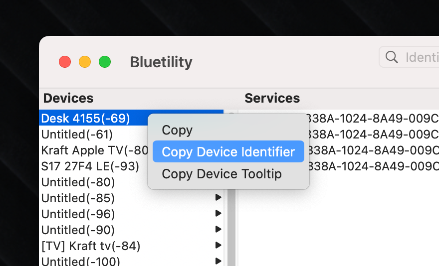

# Linak Desk Controller

Control the height of your Linak desk using bluetooth, for example the Ikea Idasen desk.

This extension is a wrapper around [linak-controller](https://github.com/rhyst/linak-controller) and requires python 3 to be installed on your system.

For supported devices please check the list here: [Supported desks](https://github.com/rhyst/linak-controller/blob/master/README.md#working-desks)

## Installation

1. Install [linak-controller](https://github.com/rhyst/linak-controller) and make sure it's available in your path.

```
pip3 install linak-controller
```

2. Set your desk to pairing mode (usually by holding down the bluetooth button) and pair your desk with your computer using [Bluetility](https://github.com/jnross/Bluetility) by clicking on it in the device list.

3. Copy the UUID of the desk by right clicking on the device in Bluetility and selecting "Copy device identifier".
   
4. Run the extension and add the UUID and your preferred standing and sitting heights to the extension settings.
5. (Optional) Set up keyboard shortcuts to toggle between your preferred heights 🥳

## Server Mode

You can run the extension in server mode in order to keep a persistent connection making the response time a lot quicker.

1. Enable server mode in the extension settings
2. Start the server in your terminal by running `linak-controller --server`

See the [Using the Server](https://github.com/rhyst/linak-controller?tab=readme-ov-file#using-the-server) for more information on server mode.

## Troubleshooting

Make sure that `linak-controller` is installed and available in your path. If linak-controller is installed and works in your terminal but not in Raycast run `which linak-controller` in your terminal and add the python bin path to the extension settings .i.e.

```bash
which linak-controller
/opt/homebrew/bin/linak-controller
```

In this case you would add `/opt/homebrew/bin/` to the extension settings.
