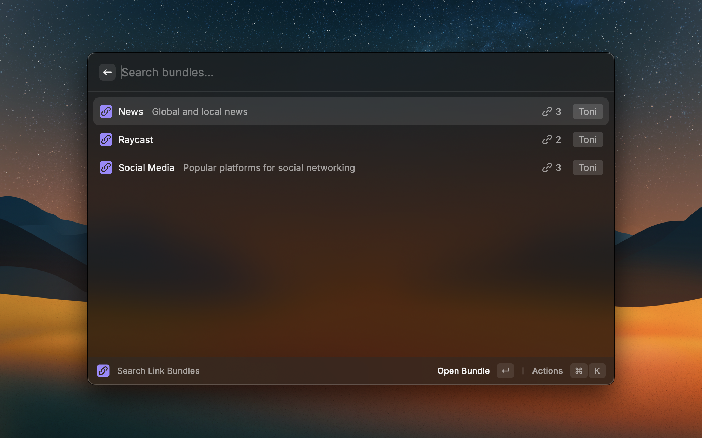
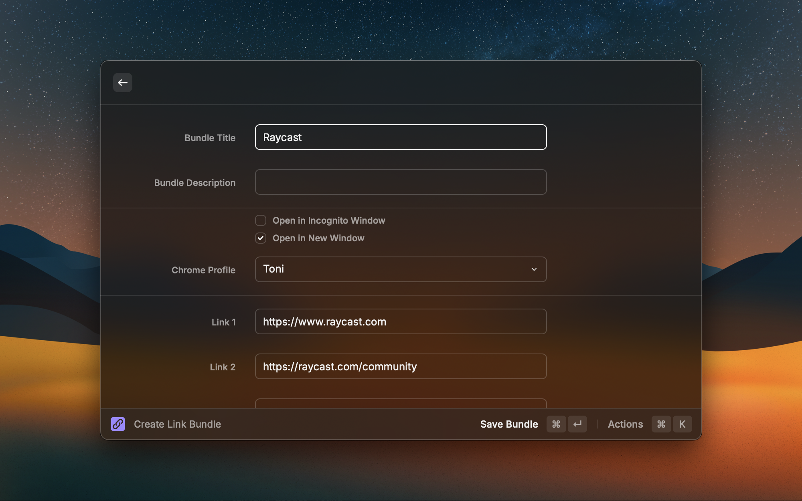

# Link Bundles

Streamline your browsing workflow by managing and launching groups of links with ease.

## Features

- 🚀 **Quick Launch**: Instantly open entire link groups with a single command.
- ✏️ **Easy Management**: Create, edit, and delete bundles with intuitive commands.
- 🔍 **Fuzzy Search**: Quickly find your bundles.
- 🎯 **Profile-Specific**: Open link groups in specific Chrome profiles.

## Commands

### Search Link Bundles

Browse and manage all your link bundles.

### Create Link Bundle

Quickly create new link bundles with a dedicated command. Add multiple URLs, set a Chrome profile, and include a description for better organization.

