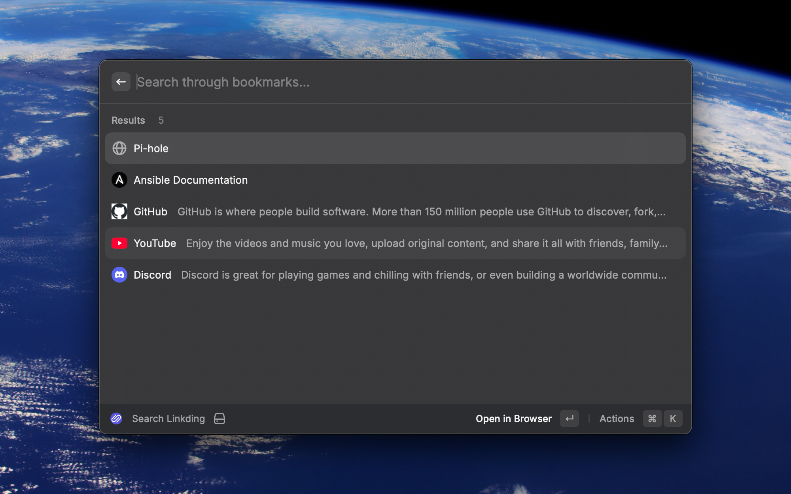
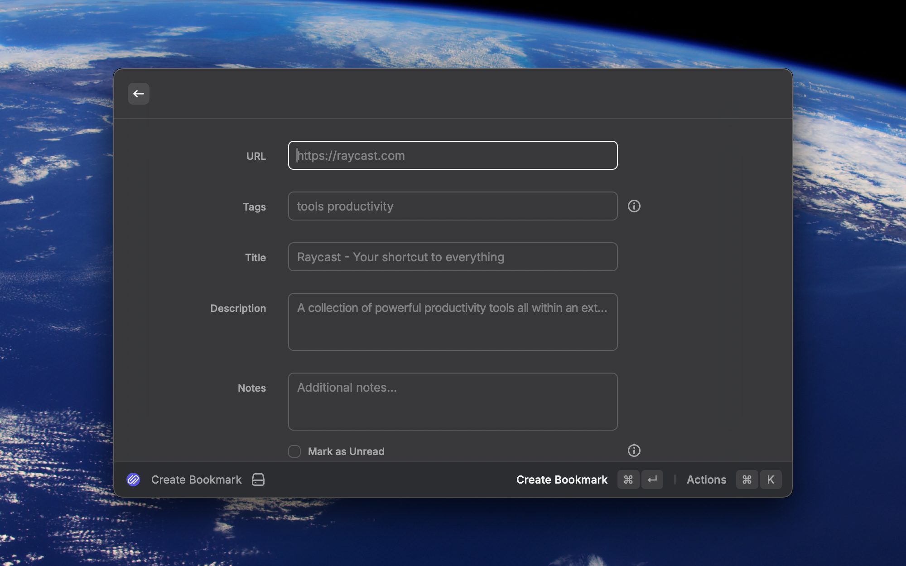

# Linkding

Uses Raycast to search through Linking bookmarks.

## Screenshots

## Features

- Support bookmark search through multiple Linkding accounts and servers
- Open bookmarks in the browser
- Copy bookmarks to clipboard
- Create and delete bookmarks in the extension

## Notice

The Linkding API key and server URL from your Linkding instance are needed to use this extension.

## Planned Features

- Update bookmarks in extension

## Contributing

Contributions are always welcome!
