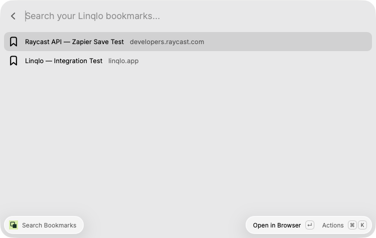
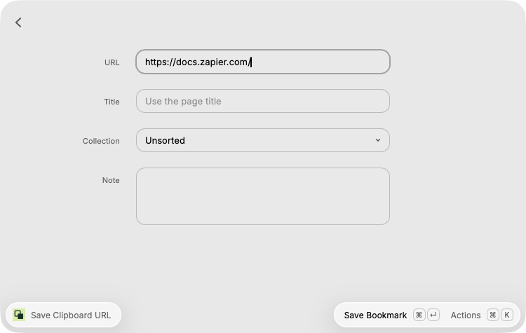
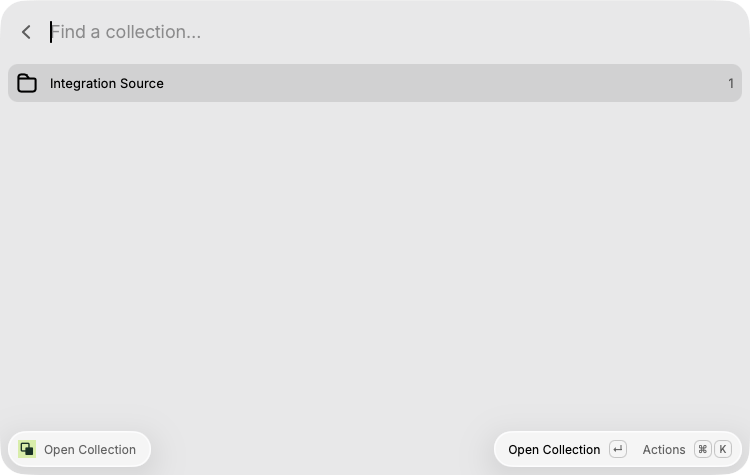

# Linqlo for Raycast

Search saved links, save a clipboard URL to a collection, and open your Linqlo collections.

## Setup

A [Linqlo account](https://linqlo.app/) is required. Integration keys are available on the free plan; normal bookmark limits still apply.

1. Open [Linqlo Settings → App integrations](https://linqlo.app/settings/integrations).
2. Select **Raycast**, name the connection, and choose **Read and save bookmarks** if you want
   to save URLs. Read-only access supports searching and opening collections.
3. Create a key and copy it into the extension's **Integration Key** preference.

Keys connect to one workspace, expire after one year, and can be revoked in Linqlo settings.
Private collections and trash are excluded. The key is shown only once in Linqlo.

## Commands

- **Search Bookmarks** — type to search, press Return to open, or Command-C to copy the URL.
- **Save Clipboard URL** — review the clipboard URL, choose a collection, add a title or note,
  then submit. An empty collection saves to Unsorted.
- **Open Collection** — search the collection list and open it in your browser.

If your key expires, use **Update Integration Key** in the command's actions menu. If saving
is denied, check both the key's write permission and your current workspace role.

## Local development

Run `npm ci`, `npm test`, `npm run lint`, `npm run build`, `npm run check-types`, then `npm run dev`.
Tests require Node.js 22.18+. Development mode loads the extension into Raycast.

When opening a collection, select the same workspace in the Linqlo web app as the one connected to this extension.

## Screenshots

