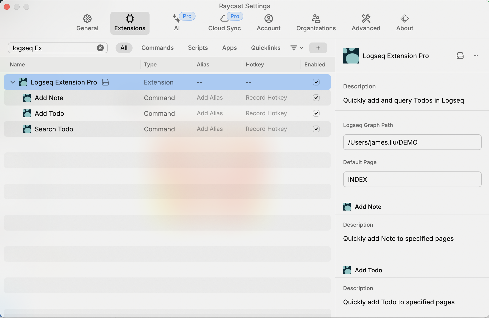
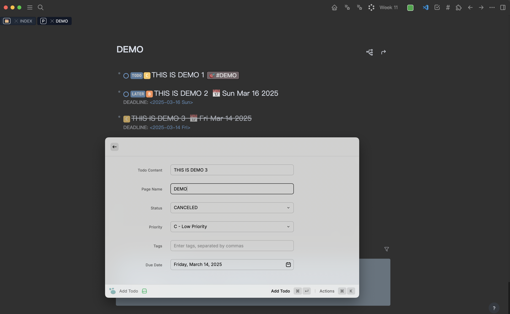
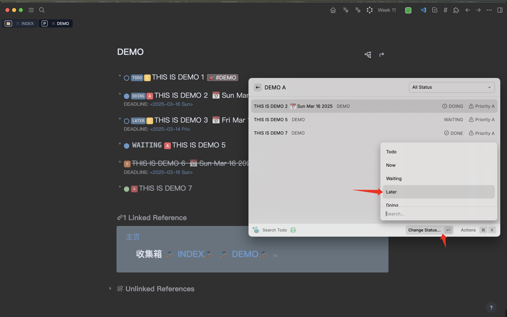
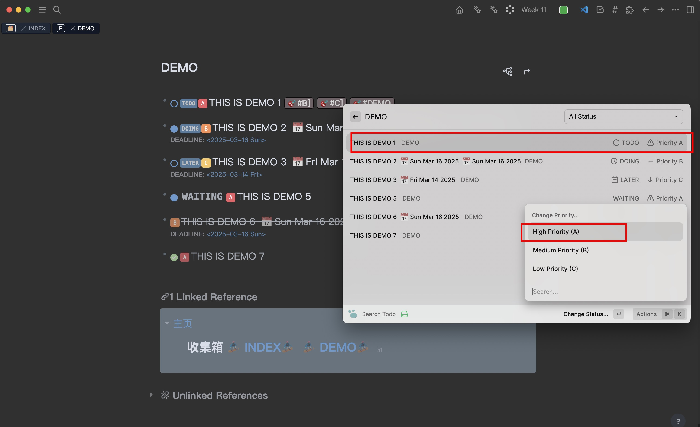

# Logseq Extension Pro

这是一个强大的 Raycast 扩展，它能让你的 Logseq 工作流程如丝般顺滑，帮你轻松管理待办事项和笔记。（再也不用担心任务管理是个麻烦事啦！）

访问我们的 [GitHub 仓库](https://github.com/ybooks240/Logseq_extension_pro) 获取源码和更新。

## 功能特色

### 待办事项管理
- 一键添加待办到任意 Logseq 页面（快得连闪电都追不上）
- 全方位的待办状态管理（从 TODO 到 DONE，状态一应俱全）
- 优先级设置（A/B/C，就像给任务打分一样简单）
- 支持多标签（给任务贴标签，就像给小朋友贴贴纸一样有趣）
- 自动格式化的截止日期设置（再也不用担心日期格式不统一啦）
- 高级待办搜索和筛选（找任务比找男/女朋友还容易）

### 笔记管理
- 快速创建笔记（想到就写，灵感不再溜走）
- 通过 Raycast 直接访问（就像芝麻开门一样便捷）

## 安装步骤

1. 从 Raycast 商店安装扩展（就像在淘宝买东西一样简单）
2. 配置必要设置（看看下面的配置部分）

## 配置说明

使用前，你需要设置两个重要配置（别担心，比填表格简单多了）：

1. **Logseq 图谱路径**：设置你的 Logseq 图谱本地路径
   - 这就是你的 Logseq 页面存储的地方
   - 示例：`/Users/username/Documents/logseq-notes/`
   

2. **默认页面**：设置添加待办时的默认页面
   - 当没有指定页面时就用这个
   - 示例：`todos`

## 使用指南

### 添加待办

1. 打开 Raycast 输入 "Add Todo"（就像发微博一样简单）
2. 填写待办详情：
   - 内容（必填，想写啥写啥）
   - 页面名称（选填，不填就用默认的）
   - 状态（TODO、NOW、WAITING、LATER、DOING、DONE、CANCELED）
   - 优先级（A - 特别重要、B - 还挺重要、C - 随缘）
   - 标签（用逗号分隔，就像给任务打上标签）
   - 截止日期（别让任务变成遗憾）
3. 按回车保存（搞定！）

### 搜索和管理待办

1. 打开 Raycast 输入 "Search Todo"
2. 使用强大的筛选选项：
   - 按状态筛选（找出所有在划水的任务）
   - 快速优先级筛选（输入 a/b/c，比 ABC 选择题还简单）
   - 关键词搜索（搜内容和页面名称，比找对象还准确）
   - 标签筛选（用标签找任务，就像超市里找商品一样方便）
   - 截止日期筛选（找出哪些任务快要到期了）

#### 待办管理功能

1. **更改待办状态**
   
   - 选择一个待办
   - 点击"更改状态"
   - 选择新状态（就像给任务换身衣服）

2. **修改优先级**
   
   - 选择一个待办
   - 点击"更改优先级"
   - 选择新的优先级（升职加薪就是这么简单）

3. **删除待办**
   
   - 选择一个待办
   - 点击"删除"
   - 确认删除（再见了，亲爱的任务）

### 添加笔记

1. 打开 Raycast 输入 "Add Note"
2. 输入笔记内容（想到什么写什么）
3. 指定页面名称（选填）
4. 按回车保存（完美！）

## 使用技巧

- 使用键盘快捷键让操作飞起来
- 善用默认页面设置（懒人必备）
- 在搜索时使用快速优先级筛选（a/b/c，比 123 还好记）
- 用标签让任务管理更有条理（给任务贴标签，就像给衣服分类一样）
- 给重要任务设置截止日期（再也不用担心忘记重要事情）

## 技术支持

如果遇到问题或有建议，欢迎访问我们的 [GitHub 仓库](https://github.com/ybooks240/Logseq_extension_pro) 提 issue（我们随时恭候您的调教）。