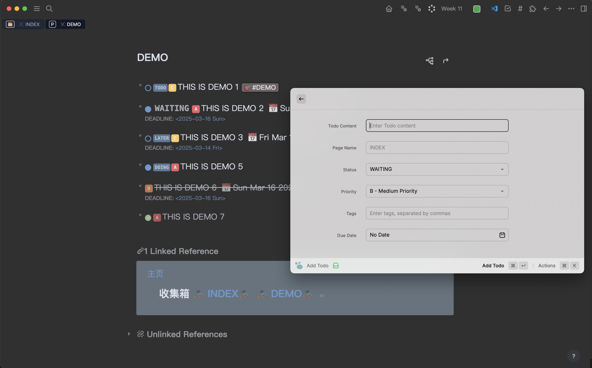
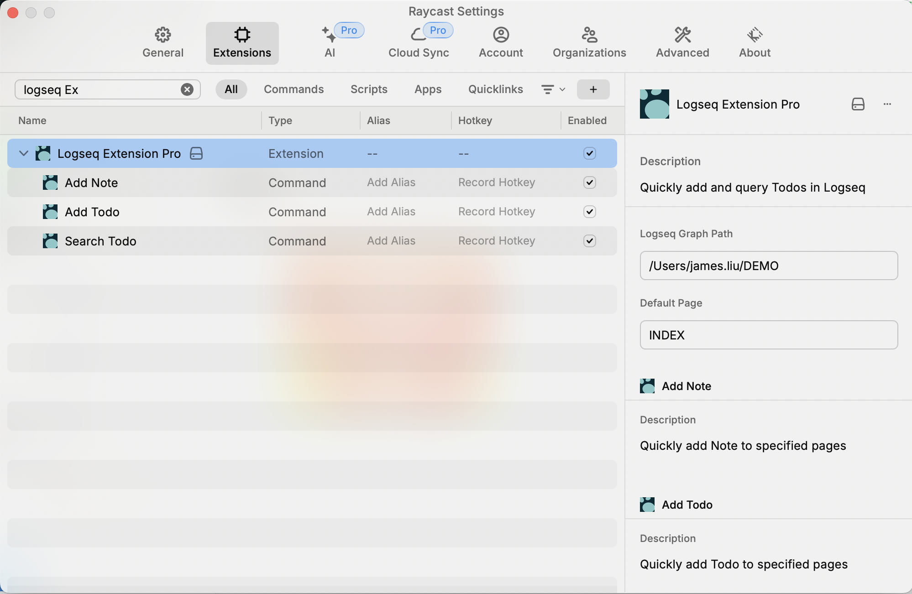
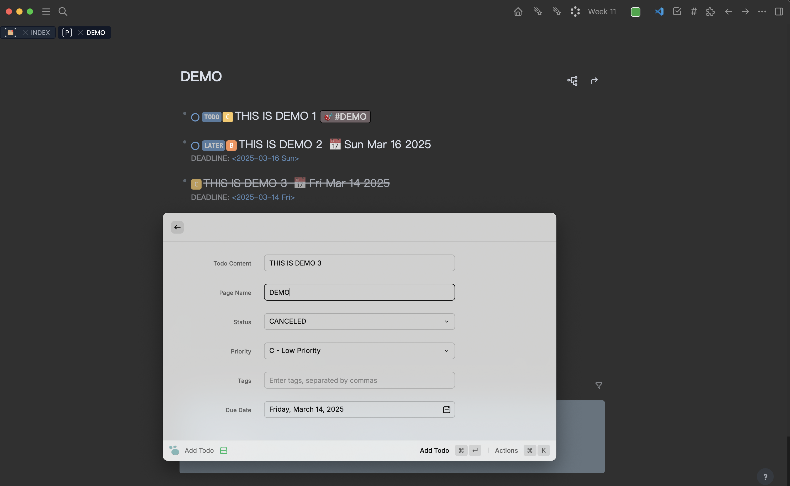
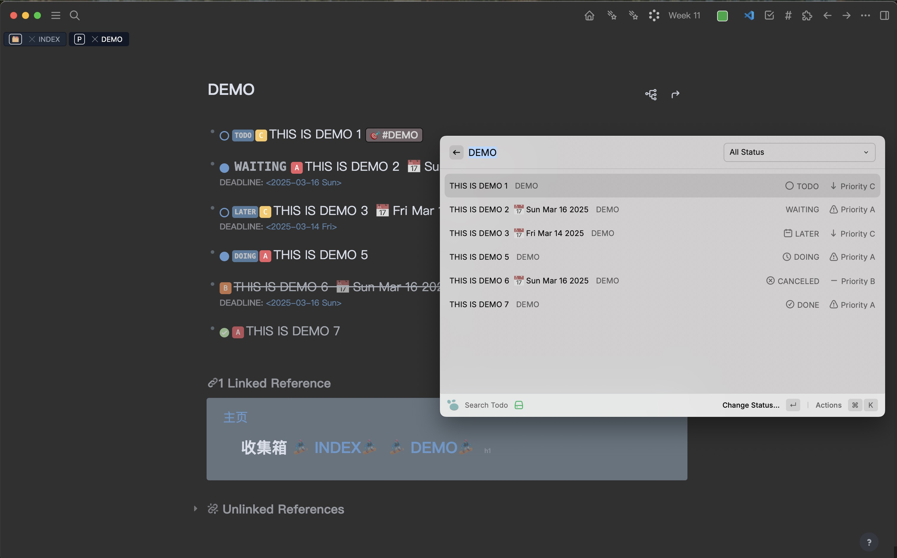
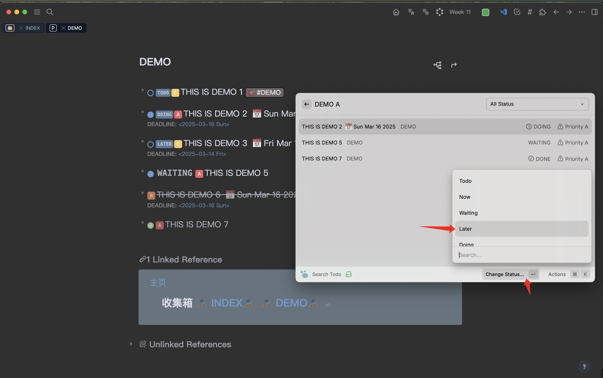
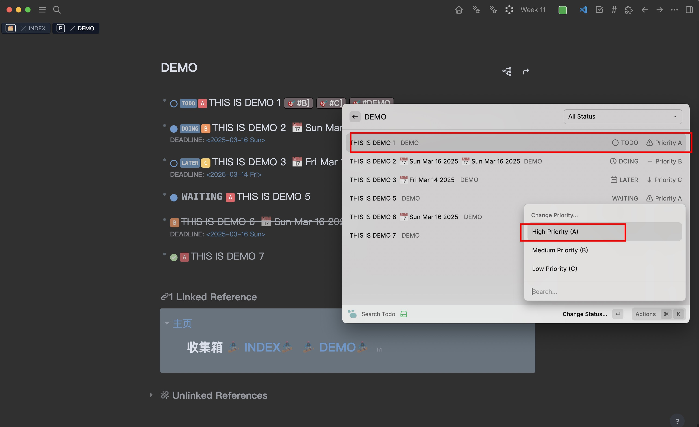
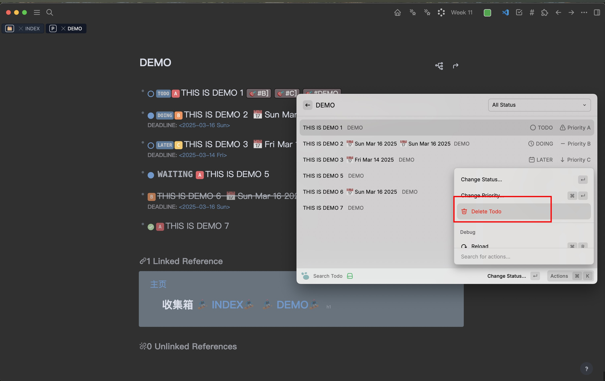
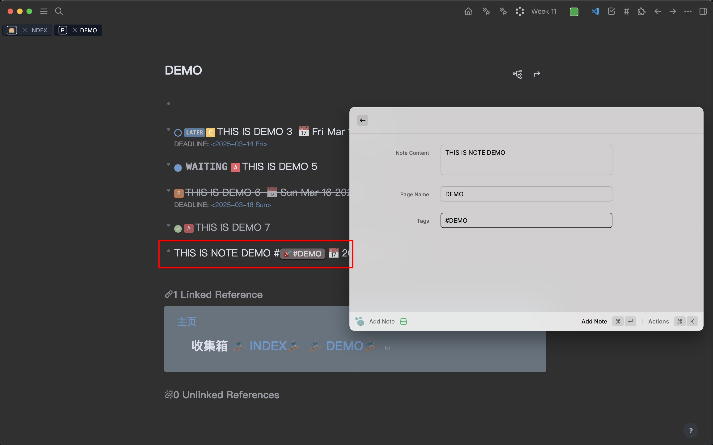

# Logseq Extension Pro

A powerful Raycast extension that enhances your Logseq workflow by providing quick access to add and manage Todos and Notes.

Visit our [GitHub repository](https://github.com/ybooks240/Logseq_extension_pro) for source code and updates.

## Features

### Todo Management
- Quick Todo addition to any Logseq page
- Comprehensive Todo status management (TODO, NOW, WAITING, LATER, DOING, DONE, CANCELED)
- Priority settings (A/B/C)
- Tag support with multiple tags
- Due date setting with automatic date formatting
- Advanced Todo search and filtering

### Note Management
- Fast note creation for any Logseq page
- Direct access through Raycast

## Installation

1. Install the extension from Raycast Store
2. Configure the required settings (see Configuration section)

## Configuration

Before using the extension, you need to set up two essential configurations:

1. **Logseq Graph Path**: Set the local path to your Logseq graph
   - This is where your Logseq pages are stored
   - Example: `/Users/username/Documents/logseq-notes/`
   

2. **Default Page**: Set the default page name for adding Todos
   - This page will be used when no specific page is selected
   - Example: `todos`

## Usage Guide

### Adding Todos

1. Open Raycast and type "Add Todo"
2. Fill in the Todo details:
   - Content (required)
   - Page name (optional, uses default if not specified)
   - Status (TODO, NOW, WAITING, LATER, DOING, DONE, CANCELED)
   - Priority (A - High, B - Medium, C - Low)
   - Tags (comma-separated)
   - Due date
3. Press Enter to save

### Searching and Managing Todos

1. Open Raycast and type "Search Todo"
2. Use the powerful filtering options:
   - Filter by status
   - Quick priority filtering (type a/b/c)
   - Keyword search (searches both content and page names)
   - Tag filtering
   - Due date filtering

#### Todo Management Features

1. **Change Todo Status**
   
   - Select a Todo
   - Choose "Change Status"
   - Pick the new status

2. **Modify Priority**
   
   - Select a Todo
   - Choose "Change Priority"
   - Select the new priority level

3. **Delete Todo**
   
   - Select a Todo
   - Choose "Delete"
   - Confirm deletion

### Adding Notes

1. Open Raycast and type "Add Note"
2. Enter your note content
3. Specify the page name (optional)
4. Press Enter to save

## Tips

- Use keyboard shortcuts for faster navigation
- Utilize the default page setting for frequently used pages
- Take advantage of the quick priority filtering in search (a/b/c)
- Use tags for better organization and easier filtering
- Set due dates for time-sensitive Todos

## Support

If you encounter any issues or have suggestions, please visit our [GitHub repository](https://github.com/ybooks240/Logseq_extension_pro) to create an issue.