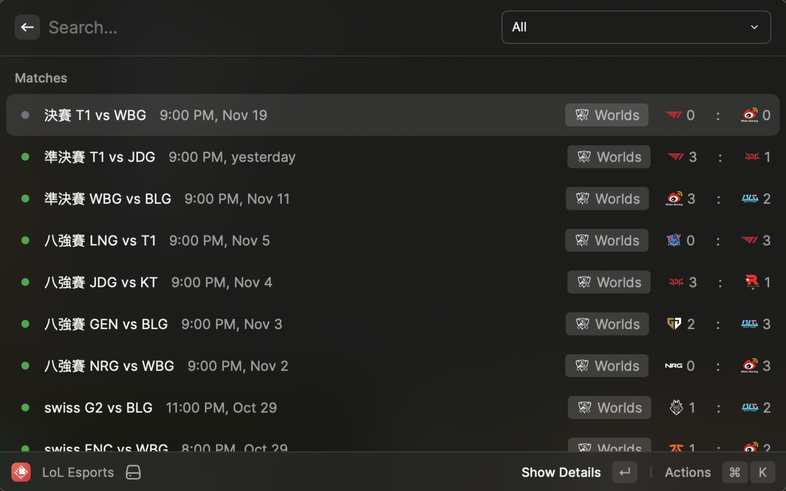

 
 

<h1 align="center">LoL Esports for Raycast</h1>

A Raycast extension 

## 开发动机

作为一名狂热的英雄联盟迷，我经常需要打开特定的网站来查询比赛日程，这个过程常常让我感到不便。我不愿意错过任何一场精彩纷呈的比赛。因此，我开发了这款 Raycast 插件，旨在随时随地方便快捷地获取比赛日程，确保我能及时关注每一场赛事。

## 功能

- [x] 显示当天的比赛日程
- [x] 根据赛区筛选赛事
- [ ] 快捷添加到日历
- [ ] 快捷打开比赛直播
- [ ] 在系统菜单栏显示当天比赛日程
- [ ] i18n Support

## 安装 &

TODO
