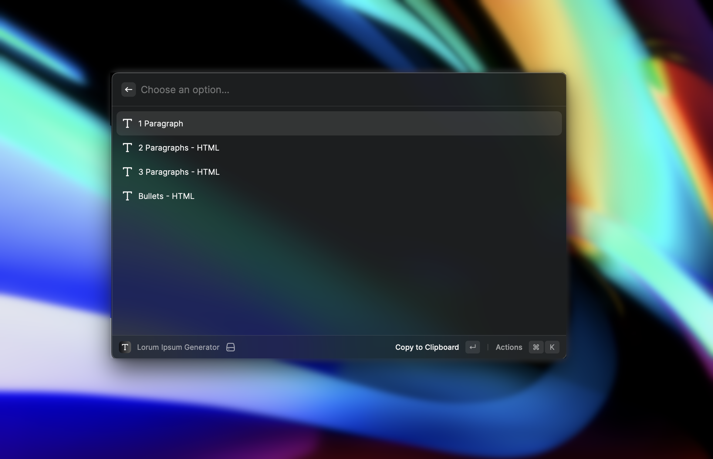

<h1 align="center">Lorum Ipsum Generator</h1>

<h3 align="center">
Get quick access to filler text.
</h3>

# What is it?

Simple Lorum Ipsum generator for those who get tired of searching for it every time.

Available options include single or multiple paragraphs and bullet lists.
