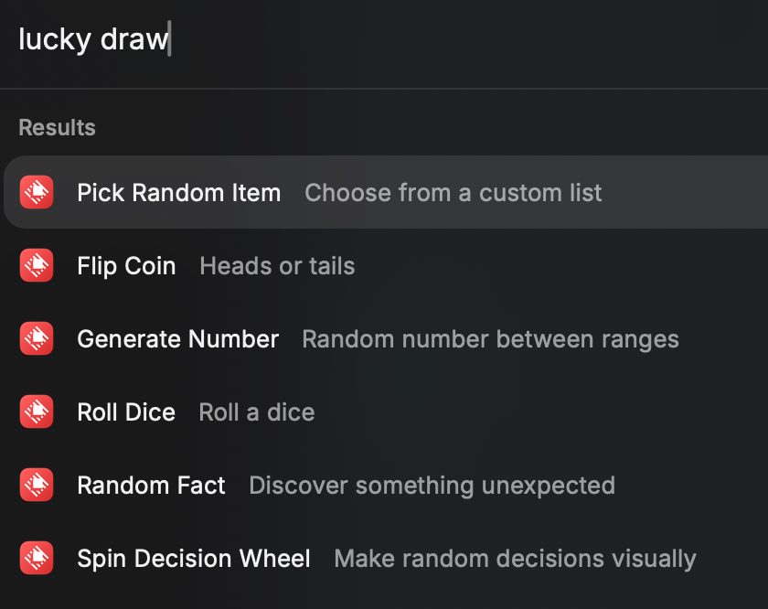
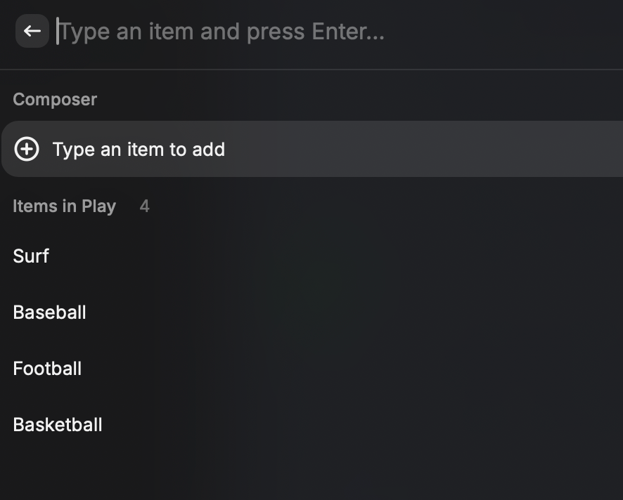
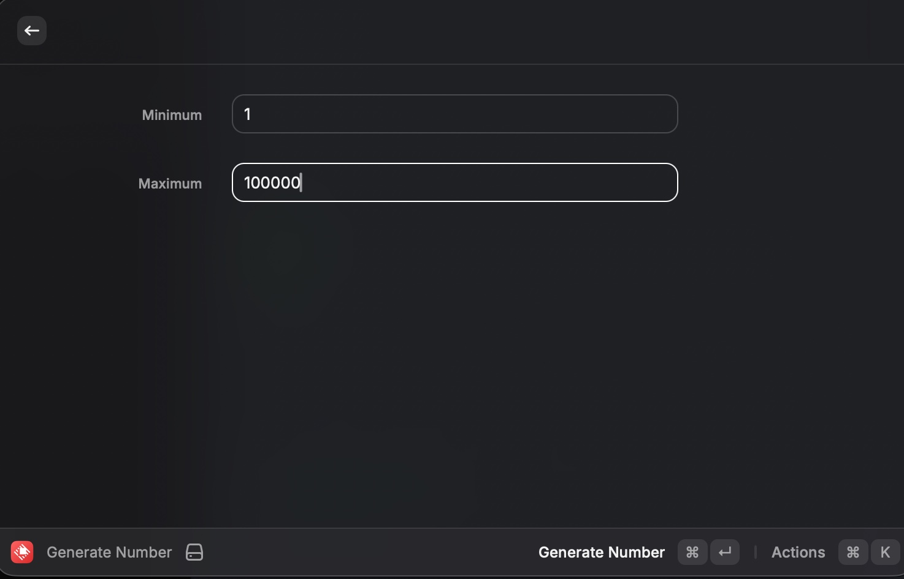

# Lucky Draw

Lucky Draw is a collection of fast randomness, decision-making, and discovery tools for Raycast.
Generate random outcomes, make choices, explore fun utilities, and interact with lightweight widgets — all without leaving your keyboard.

Built for quick workflows, everyday use for everybody

## Visual preview

Lucky Draw is designed around quick, lightweight command flows and compact
result views.

## Screenshots

These screenshots show the main command launcher and a few representative
flows.

### Command list

### Pick random item

### Flip coin

### Generate number

### Random fact

## Currently available commands

These are the Raycast commands included in this extension:

- `flip-coin` - Flip Coin
- `roll-dice` - Roll Dice
- `generate-number` - Generate Number
- `pick-random-item` - Pick Random Item
- `spin-decision-wheel` - Spin Decision Wheel
- `random-fact` - Random Fact

## Development scripts

Use these npm scripts while developing the extension:

- `npm run build` - Build the extension
- `npm run dev` - Start the Raycast development server
- `npm run lint` - Run lint checks
- `npm run fix-lint` - Fix lint issues
- `npm run test` - Run Vitest in watch mode
- `npm run test:run` - Run Vitest once
- `npm run test:watch` - Run Vitest in watch mode
- `npm run publish` - Publish the extension

## Usage examples

Here is what each command does in practice:

- `Flip Coin`: Open the command, press **Flip Coin**, and copy or flip again
  from the result view.
- `Roll Dice`: Open the command, press **Roll Die**, and copy or roll again
  from the result view.
- `Generate Number`: Enter a minimum and maximum value, then press
  **Generate Number** to get a number in that inclusive range.
- `Pick Random Item`: Type items one by one, press **Enter** to add them, then
  use **Cmd+Enter** to pick one at random.
- `Spin Decision Wheel`: Type options one by one, press **Enter** to add them,
  then use **Cmd+Enter** to spin the wheel.
- `Random Fact`: Open the command to fetch a fact, then use **Get Another
  Fact** to refresh it or **Open Link** when a source link is available.
